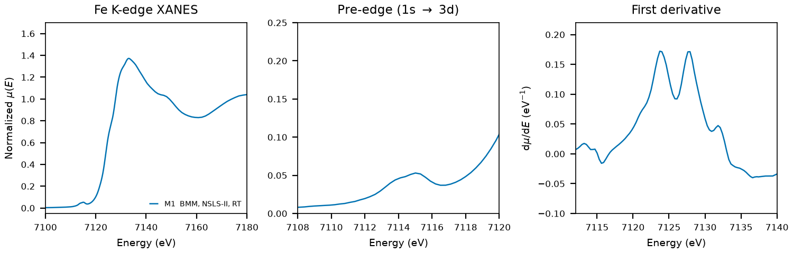

 # Aegirine (Acmite)

## Overview

- **Mineral Name**: Aegirine (also known as Acmite, IMA approved)
- **Chemical Formula**: NaFeSi2O6 (Sodium iron clinopyroxene)
- **Fe Oxidation State**: Fe3+
- **Coordination Geometry**: Distorted octahedral (O:6, site symmetry $2$)
- **Symmetry-Inequivalent Fe Sites**: 1 (Wyckoff `4e`, M1 site), the same in every structure in this folder
- **Structure**: Single-chain inosilicate ($[\text{Si}_2\text{O}_6^{4-}]_n$) with edge-sharing octahedral chains (M1 site occupied by Fe3+) and 8-fold coordinated M2 sites occupied by Na+.

---

## Recommended Spectrum for Comparison with Calculations

- For conventional XANES calculations, use `NIST/Fe-Aegerine.xdi` (M1). It is the primary reference measurement combining raw $\mu$, a simultaneous Fe foil reference channel for absolute energy calibration ($7112.0\text{ eV}$), and a dense XANES grid ($0.30\text{ eV}$ step).

---

## Crystal Structures

### Materials Project

| File | MP ID | Space Group | Lattice Parameters | $d$(Fe-O) |
| :--- | :--- | :--- | :--- | :--- | 
| `MP/mp-21867.cif` | `mp-21867` | $C2/c$ (15) | $a = 9.8276\text{ \AA}, b = 8.9072\text{ \AA}, c = 5.3631\text{ \AA}, \beta = 107.83^\circ$ | $1.9613$ to $2.1495\text{ \AA}$ (mean $2.0515\text{ \AA}$) |

Notes:

- The monoclinic $C2/c$ symmetry of the CIF file matches the experimental clinopyroxene space group at `symprec = 0.01`. The CIF is written in the $I$-centered cell ($a = 9.6470\text{ \AA}$, $\beta = 104.12^\circ$); the table gives the standard $C2/c$ setting used by the COD entries.
- The mean calculated Fe-O bond distance ($2.0515\text{ \AA}$) is within 1.4% of the most recent room temperature refinement, `COD/cod_9013272.cif` ($2.0239\text{ \AA}$).
- `MP/mp-21867.json` lists 22 ICSD codes: `9671`, `10219`, `10220`, `10221`, `156560`, `156561`, `157733`, `158082`, `158083`, `159539`, `161975`, `161976`, `161977`, `161978`, `161979`, `161980`, `161981`, `161982`, `180311`, `180312`, `180313`, `263073`. Two of them (`158083`, `161975`) correspond to the COD entries below.

### Crystallography Open Database (COD) and ICSD Cross-References

| File | ICSD ID | Space Group | Lattice Parameters | $d$(Fe-O) | Reference |
| :--- | :--- | :--- | :--- | :--- | :--- |
| `COD/cod_9005439.cif` | `158083` | $C2/c$ (15) | $a = 9.6543\text{ \AA}, b = 8.8070\text{ \AA}, c = 5.2943\text{ \AA}, \beta = 107.32^\circ$ | $1.9367$ to $2.0920\text{ \AA}$ (mean $2.0184\text{ \AA}$) | Redhammer et al. (2000), *Eur. J. Mineral.* 12, 105 (synthetic, sample ae100/F3d) |
| `COD/cod_9013272.cif` | `161975` | $C2/c$ (15) | $a = 9.6539\text{ \AA}, b = 8.7928\text{ \AA}, c = 5.2935\text{ \AA}, \beta = 107.44^\circ$ | $1.9313$ to $2.1131\text{ \AA}$ (mean $2.0239\text{ \AA}$) | McCarthy et al. (2008), *Am. Mineral.* 93, 1829 ($P = 0.0001\text{ GPa}$) |

Notes:

- Both entries are ambient-condition end-member structures ($T \approx 298\text{ K}$, $P = 1\text{ atm}$). Only `cod_9013272.cif` records the pressure in the CIF tags; the temperatures come from the papers. `cod_9013272.cif` is the ambient point of a high-pressure series, and `cod_9005439.cif` is the flux-grown aegirine end member of a hedenbergite-aegirine series.
- `158083` has the cell and the Fe and Na coordinates of `cod_9005439.cif` ($V = 429.7\text{ \AA}^3$, $y_\text{Fe} = 0.8985$, $y_\text{Na} = 0.2983$) in the AFLOW mirror of the ICSD entry. `161975` is not mirrored, but `161976` matches the next McCarthy pressure point (`cod_9013273.cif` in COD, $V = 423.0\text{ \AA}^3$), so the eight IDs `161975` to `161982` follow the eight COD entries `9013272` to `9013279` in order. Both papers are in the MP provenance references. The Nestola (2007) and Cameron (1973) entries were removed: `159539` is not mirrored, and the Cameron IDs (`9671`, `10219` to `10221`) are the high-temperature points.

---

## Experimental XAS Spectra

| ID | File (XASDB duplicate) | Source and date | $T$ | XANES step |
| :--- | :--- | :--- | :--- | :--- | 
| M1 | `NIST/Fe-Aegerine.xdi` (`XASDB/Aegerine_id9pyqfv.dat`) | BMM, NSLS-II, 2023 (Ravel) | RT | $0.30\text{ eV}$ 

Notes:

- `XASDB/Aegerine_id9pyqfv.dat`: XASDB copy of `NIST/Fe-Aegerine.xdi` (same energy, $I_0$, $I_t$, $I_r$) plus a linearly rescaled `Mutrans` column.
- Fe foil reference channel, derivative maximum $7111.6\text{ eV}$. Shift $+0.41\text{ eV}$ to put the foil at $7112.0\text{ eV}$.
- Transmission, $\mu x \approx 4$.
- The derivative has two maxima of equal height, $7124$ and $7128\text{ eV}$ (shifted axis); pre-edge peak $7115.0\text{ eV}$. The M1 site has no inversion center, so the weak pre-edge reflects the small distortion of the octahedron, not centrosymmetry.
- PEG pellet, room temperature, sample courtesy of Martin Stennett (University of Sheffield). The header does not say whether the specimen is natural or synthetic. Natural aegirine commonly deviates from the end member (Ca, Al, Ti, Mg), and this is the only measurement in the folder, so no cross-laboratory check is possible.
