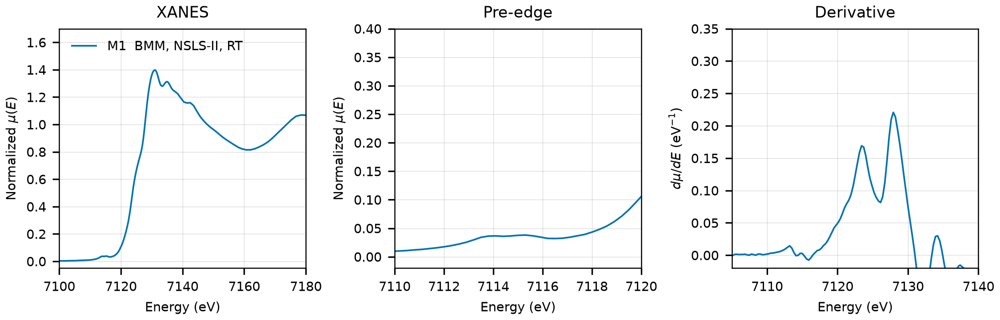

# Andradite (Ca3Fe2(SiO4)3)

## Overview

- **Mineral Name**: Andradite (IMA approved)
- **Chemical Formula**: Ca3Fe2(SiO4)3 (Calcium iron garnet)
- **Fe Oxidation State**: 3+
- **Coordination Geometry**: Octahedral (O:6, site symmetry $\bar{3}$)
- **Symmetry-Inequivalent Fe Sites**: 1 (Wyckoff `16a` in $Ia\bar{3}d$), the same in every structure in this folder
- **Structure**: Cubic garnet crystal structure ($Ia\bar{3}d$, space group 230) consisting of a three-dimensional framework of alternating corner-sharing $\text{FeO}_6$ octahedra and $\text{SiO}_4$ tetrahedra with 8-fold coordinated $\text{Ca}^{2+}$ dodecahedral sites.

---

## Recommended Spectrum for Comparison with Calculations

- For conventional XANES calculations, use `NIST/Fe-Andradite.xdi` (M1). It provides a transmission measurement with a simultaneous Fe foil reference channel for absolute energy calibration ($7112.0\text{ eV}$) and a $0.30\text{ eV}$ XANES grid.

---

## Crystal Structures

### Materials Project

| File | MP ID | Space Group | Lattice Parameters | $d$(Fe-O) |
| :--- | :--- | :--- | :--- | :--- |
| `MP/mp-6672.cif` | `mp-6672` | $Ia\bar{3}d$ (230) | $a = 12.1931\text{ \AA}$ | $2.0464\text{ \AA}$ |

Notes:

- The cubic $Ia\bar{3}d$ symmetry of the CIF file matches the experimental garnet space group at `symprec = 0.01`.
- The `material_id` field in `MP/mp-6672.json` reads `mp-aaaaajwq` (scrambled), so the file content itself does not confirm the `mp-6672` ID.
- `MP/mp-6672.json` lists 33 ICSD codes: `28271`, `34845`, `38115`, `50627`, `50628`, `52393`, `66667`, `66668`, `66669`, `66670`, `66671`, `77431`, `156530`, `187907`, `187908`, `187909`, `187910`, `187911`, `187912`, `187913`, `187914`, `187915`, `187916`, `187917`, `187918`, `187919`, `202960`, `202961`, `202962`, `202963`, `202964`, `202965`, `203209`. One of them (`203209`) corresponds to the COD entry below.

### Crystallography Open Database (COD) and ICSD Cross-References

| File | ICSD ID | Space Group | Lattice Parameters | $d$(Fe-O) | Reference |
| :--- | :--- | :--- | :--- | :--- | :--- |
| `COD/cod_2101484.cif` | `203209` | $Ia\bar{3}d$ (230) | $a = 12.0643\text{ \AA}$ | $2.0206\text{ \AA}$ | Pilati et al. (1996), *Acta Cryst. B* 52, 239 (natural, Val Malenco, $T = 293(2)\text{ K}$) |

Notes:

- The entry is an ambient-condition end-member structure ($T = 293(2)\text{ K}$ in the CIF tag, $P = 1\text{ atm}$).
- `203209` matches the Pilati (1996) cell and O coordinates ($a = 12.0643\text{ \AA}$, O at $0.0393, 0.0486, 0.6554$) in the AFLOW mirror of the ICSD entry, and the paper is in the MP provenance references; `28271` is a different refinement ($a = 12.061\text{ \AA}$).

---

## Experimental XAS Spectra

| ID | File (XASDB duplicate) | Source and date | $T$ | XANES step |
| :--- | :--- | :--- | :--- | :--- |
| M1 | `NIST/Fe-Andradite.xdi` (`XASDB/Andradite_idemsvvd.dat`) | BMM, NSLS-II, 2023 (Ravel) | RT | $0.30\text{ eV}$ |

Notes:

- `XASDB/Andradite_idemsvvd.dat`: XASDB copy of `NIST/Fe-Andradite.xdi` (same energy, $I_0$, $I_t$, $I_r$) plus a min-max scaled `Mutrans` column.
- Fe foil reference channel, derivative maximum $7111.6\text{ eV}$. Shift $+0.40\text{ eV}$ to put the foil at $7112.0\text{ eV}$.
- Transmission, $\mu x \approx 2.5$.
- Derivative maxima at $7123$ and $7128\text{ eV}$ (shifted axis), the second higher; pre-edge plateau at $7114$ to $7115\text{ eV}$. The Fe site is centrosymmetric, hence the weak pre-edge.
- PEG pellet, room temperature, sample courtesy of Martin Stennett (University of Sheffield).
