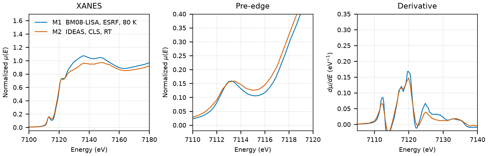

# Chalcopyrite (CuFeS2)

## Overview

- **Mineral Name**: Chalcopyrite (IMA approved)
- **Chemical Formula**: CuFeS2 (Copper iron sulfide)
- **Fe Oxidation State**: 3+
- **Coordination Geometry**: Tetrahedral (S:4, site symmetry $\bar{4}$)
- **Symmetry-Inequivalent Fe Sites**: 1, the same in every structure in this folder (Wyckoff `4b` in $I\bar{4}2d$ for the COD structures; the spglib standardization of the MP primitive cell labels the same site `4a`, an equivalent origin choice)
- **Structure**: Tetragonal chalcopyrite-type crystal structure ($I\bar{4}2d$, space group 122), superlattice derivative of the zincblende structure with alternating corner-sharing $\text{CuS}_4$ and $\text{FeS}_4$ tetrahedra.

---

## Recommended Spectrum for Comparison with Calculations

- For conventional XANES and EXAFS calculations, use `LISA/CuFeS2_Fe_80K_111.xdi` (M1). It provides a high-resolution transmission measurement at 80 K ($0.25\text{ eV}$ XANES step) with a simultaneous Fe foil reference channel for absolute energy calibration ($7112.0\text{ eV}$) and an extended EXAFS range to $8956.6\text{ eV}$.

---

## Crystal Structures

### Materials Project

| File | MP ID | Space Group | Lattice Parameters | $d$(Fe-S) |
| :--- | :--- | :--- | :--- | :--- |
| `MP/mp-3497.cif` | `mp-3497` | $I\bar{4}2d$ (122) | $a = 5.2636\text{ \AA}, c = 10.2298\text{ \AA}$ | $2.2335\text{ \AA}$ |

Notes:

- The body-centered tetragonal $I\bar{4}2d$ symmetry of the CIF file matches the experimental chalcopyrite space group at `symprec = 0.01`.
- `MP/mp-3497.json` lists 10 ICSD codes: `2518`, `30289`, `60166`, `80094`, `80095`, `94554`, `261882`, `261883`, `627337`, `627340`. One of them (`2518`) corresponds to the COD entry below; `60166` and `94554` reuse the same cell with idealized S coordinates.
- The `material_id` field in `MP/mp-3497.json` reads `mp-aaaaafen` (scrambled, like the task IDs), so the file content itself does not confirm the `mp-3497` ID. The ID comes from the file name and the download provenance.

### Crystallography Open Database (COD) and ICSD Cross-References

| File | ICSD ID | Space Group | Lattice Parameters | $d$(Fe-S) | Reference |
| :--- | :--- | :--- | :--- | :--- | :--- |
| `COD/cod_9007572.cif` | `2518` | $I\bar{4}2d$ (122) | $a = 5.2890\text{ \AA}, c = 10.4230\text{ \AA}$ | $2.2566\text{ \AA}$ | Hall & Stewart (1973), *Acta Cryst. B* 29, 579 ($T = 298\text{ K}$) |

Notes:

- Ambient-condition end-member structure ($T \approx 298\text{ K}$, $P = 1\text{ atm}$); the CIF has no temperature tag, room temperature comes from the paper.
- `2518` matches the ICSD cell ($a = 5.289$, $c = 10.423\text{ \AA}$) and S coordinate ($x = 0.2574$) mirrored in AFLOW, and Hall & Stewart (1973) is in the MP provenance references. The Knight (2011) and Elliot (2010) entries were removed: `261882` is a high-temperature Knight point ($a = 5.382\text{ \AA}$), and neither paper is in the MP provenance.

---

## Experimental XAS Spectra

| ID | File | Source and date | $T$ | XANES step |
| :--- | :--- | :--- | :--- | :--- |
| M1 | `LISA/CuFeS2_Fe_80K_111.xdi` | BM08-LISA, ESRF, 2024 | 80 K | $0.25\text{ eV}$ |
| M2 | `XASDB/Chalcopyrite_idx9912a.dat` | IDEAS, CLS, 2019 (Industrial Science Group) | RT | $0.50\text{ eV}$ |

Notes:

- Both files carry a foil channel with the derivative maximum at $7112.0\text{ eV}$, so the axes are already calibrated.
- M1: transmission, Athena export without raw counts, $\mu x \approx 2.7$. M2: transmission, $\mu x \approx 0.8$.
- Derivative maximum $7119.9\text{ eV}$ (M1) and $7120.0\text{ eV}$ (M2); pre-edge peak $7113.2\text{ eV}$ (M1) and $7113.4\text{ eV}$ (M2). The non-centrosymmetric tetrahedral $\text{FeS}_4$ site (site symmetry $\bar{4}$ / $S_4$) enables strong $p$-$d$ mixing, hence the strong pre-edge.
- In M2 (`Chalcopyrite_idx9912a.dat`), recalculate the absorption spectrum from the raw detector columns as $\mu(E) = \ln(I_0 / I_{trans})$ (columns 2 and 3), because the 5th column (`Mutrans`) is min-max scaled to $[0, 1]$.
- M1 was measured at 80 K with a liquid-nitrogen-cooled Si(111) double-crystal monochromator and covers an extended EXAFS range up to $8956.6\text{ eV}$ ($k \approx 22\text{ \AA}^{-1}$).
