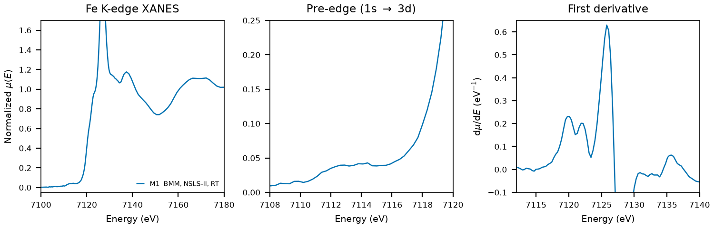

# Cordierite ((Mg,Fe)2Al4Si5O18)

## Overview

- **Mineral Name**: Cordierite (IMA approved); the Fe end member is sekaninaite
- **Chemical Formula**: (Mg,Fe)2Al4Si5O18; the structures in this folder are the Fe end member Fe2Al4Si5O18
- **Fe Oxidation State**: Fe2+
- **Coordination Geometry**: Octahedral (O:6, site symmetry $2$)
- **Symmetry-Inequivalent Fe Sites**: 1 (Wyckoff `8h` in $Cccm$), the same in every structure in this folder
- **Structure**: Orthorhombic low-cordierite structure ($Cccm$, space group 66) of six-membered rings of (Si,Al)O4 tetrahedra stacked along $c$ into channels, linked by (Fe,Mg)O6 octahedra and AlO4 tetrahedra.

---

## Recommended Spectrum for Comparison with Calculations

- For conventional XANES calculations, use `NIST/Fe-Cordierite.xdi` (M1), the only measurement in the folder. It combines raw $\mu$, a simultaneous Fe foil reference channel, and a $0.30\text{ eV}$ XANES grid, but the edge step is only $0.09$ on a pellet absorption of $1.5$, so use it for energies and treat the amplitudes with caution.

---

## Crystal Structures

### Materials Project

| File | MP ID | Space Group | Lattice Parameters | $d$(Fe-O) |
| :--- | :--- | :--- | :--- | :--- |
| `MP/mp-1204107.cif` | `mp-1204107` | $Cccm$ (66) | $a = 17.4511\text{ \AA}, b = 9.9286\text{ \AA}, c = 9.4085\text{ \AA}$ | $2.1789$ to $2.1967\text{ \AA}$ (mean $2.1864\text{ \AA}$) |

Notes:

- The orthorhombic $Cccm$ symmetry of the CIF file matches the experimental Fe-cordierite space group at `symprec = 0.01`, with Fe on `8h` (site symmetry $2$). The table uses the cordierite axis order of the COD file ($a > b > c$); the spglib standard cell exchanges $a$ and $b$. The CIF stores a 58-atom primitive cell.
- `MP/mp-1204107.json` lists 1 ICSD code: `237135`, which corresponds to the COD entry below.
- The `material_id` field in `MP/mp-1204107.json` is scrambled, so the file content itself does not confirm the `mp-1204107` ID.

### Crystallography Open Database (COD) and ICSD Cross-References

| File | ICSD ID | Space Group | Lattice Parameters | $d$(Fe-O) | Reference |
| :--- | :--- | :--- | :--- | :--- | :--- |
| `COD/cod_1548717.cif` | `237135` | $Cccm$ (66) | $a = 17.2306\text{ \AA}, b = 9.8239\text{ \AA}, c = 9.2892\text{ \AA}$ | $2.1552$ to $2.1584\text{ \AA}$ (mean $2.1566\text{ \AA}$) | Haefeker et al. (2014), *Mineral. Petrol.* 108, 469 (synthetic, $T = 298\text{ K}$) |

Notes:

- Ambient-condition ordered Fe end member ($T = 298\text{ K}$ in the CIF tag, $P = 1\text{ atm}$), the orthorhombic polymorph of synthetic Fe-cordierite.
- `237135` is not mirrored in AFLOW, but it is the only ICSD entry of the MP record and Haefeker et al. (2014) is the only reference in the MP provenance, so the link is unambiguous. The natural sekaninaite entries in COD (Hochella 1979, Radica 2013) have mixed Fe, Mg occupancies and were not used.

---

## Experimental XAS Spectra

| ID | File (XASDB duplicate) | Source and date | $T$ | XANES step |
| :--- | :--- | :--- | :--- | :--- |
| M1 | `NIST/Fe-Cordierite.xdi` (`XASDB/Cordierite_idkzt2nx.dat`) | BMM, NSLS-II, 2023 (Ravel) | RT | $0.30\text{ eV}$ |

Notes:

- `XASDB/Cordierite_idkzt2nx.dat`: XASDB copy of `NIST/Fe-Cordierite.xdi` (same energy, $I_0$, $I_t$, $I_r$) plus a min-max scaled `Mutrans` column.
- The XDI header names the sample `(Mg,Fe)2Al3(Si5AlO18)`, a natural Mg-Fe cordierite, not the Fe end member of the structures above.
- Fe foil reference channel, derivative maximum $7111.6\text{ eV}$. Shift $+0.41\text{ eV}$ to put the foil at $7112.0\text{ eV}$.
- Transmission, $\mu x \approx 1.5$, of which only $0.09$ comes from the sample, so the normalized amplitudes are unreliable.
- $E_0 = 7125.8\text{ eV}$ (derivative maximum, single sharp peak, shifted axis); the white line at $7127\text{ eV}$ is narrow and tall. Pre-edge plateau at $7112$ to $7114.5\text{ eV}$.
- PEG pellet, room temperature, sample courtesy of Martin Stennett (University of Sheffield).
