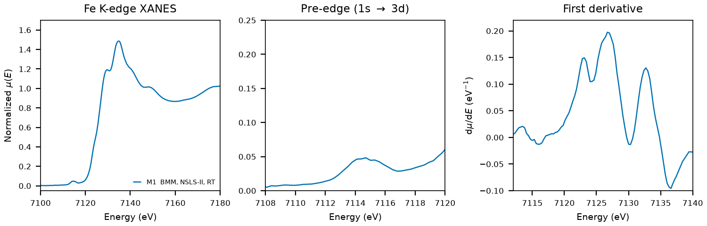

# Epidote (Ca2Al2Fe(SiO4)(Si2O7)O(OH))

## Overview

- **Mineral Name**: Epidote (IMA approved)
- **Chemical Formula**: Ca2Al2Fe(SiO4)(Si2O7)O(OH), or Ca2Al2FeSi3O12(OH) (calcium aluminium iron sorosilicate hydroxide)
- **Fe Oxidation State**: Fe3+
- **Coordination Geometry**: Distorted octahedral (O:6, site symmetry $m$)
- **Symmetry-Inequivalent Fe Sites**: 1 (Wyckoff `2e`, the M3 site in $P2_1/m$), the same in every structure in this folder
- **Structure**: Monoclinic epidote structure ($P2_1/m$, space group 11) with edge-sharing chains of AlO6 octahedra (M1, M2) along $b$, the larger M3 octahedron attached to the M2 chain and occupied by Fe3+, linked by SiO4 and Si2O7 groups; Ca occupies the A1 and A2 sites.

---

## Recommended Spectrum for Comparison with Calculations

- For conventional XANES calculations, use `NIST/Fe-Epidote.xdi` (M1), the only measurement in the folder. It combines raw $\mu$, a simultaneous Fe foil reference channel, and a $0.30\text{ eV}$ XANES grid.
- For the structure, prefer `MP/mp-696825.cif`, which derives from the neutron refinements of Nozik (1978) and Kvick (1988); the COD entry is a 1953 refinement with two-decimal coordinates (see below).

---

## Crystal Structures

### Materials Project

| File | MP ID | Space Group | Lattice Parameters | $d$(Fe-O) |
| :--- | :--- | :--- | :--- | :--- |
| `MP/mp-696825.cif` | `mp-696825` | $P2_1/m$ (11) | $a = 9.0083\text{ \AA}, b = 5.7150\text{ \AA}, c = 10.2594\text{ \AA}, \beta = 115.37^\circ$ | $1.9097$ to $2.2700\text{ \AA}$ (mean $2.0814\text{ \AA}$) |

Notes:

- The monoclinic $P2_1/m$ symmetry of the CIF file matches the experimental epidote space group at `symprec = 0.01`, with Fe on `2e` (site symmetry $m$). The CIF stores a 44-atom $P1$ cell; the table gives the spglib standard cell. `MP/mp-696825.json` puts the structure $0.011\text{ eV/atom}$ above the hull (`is_stable: false`).
- `MP/mp-696825.json` lists 2 ICSD codes: `34209`, `63661`. They are the Nozik et al. (1978) and Kvick et al. (1988) neutron refinements (the two references in the MP provenance); neither is in COD.
- The `material_id` field in `MP/mp-696825.json` reads `mp-aaabnquz` (scrambled), so the file content itself does not confirm the `mp-696825` ID.

### Crystallography Open Database (COD) and ICSD Cross-References

| File | ICSD ID | Space Group | Lattice Parameters | $d$(Fe-O) | Reference |
| :--- | :--- | :--- | :--- | :--- | :--- |
| `COD/cod_1529622.cif` | none in MP | $P2_1/m$ (11) | $a = 8.91\text{ \AA}, b = 5.63\text{ \AA}, c = 10.25\text{ \AA}, \beta = 115.4^\circ$ | $1.92$ to $2.22\text{ \AA}$ (mean $2.04\text{ \AA}$) | Belov & Rumanova (1953), *Dokl. Akad. Nauk SSSR* 89, 853 |

Notes:

- COD has no modern refinement of end-member epidote. The three entries with the end-member formula are Ito (1947), Belov & Rumanova (1953) and Ito et al. (1954), all photographic work with two-decimal coordinates; the modern entries (Giuli 1999, Nagashima 2010) are Al-Fe disordered compositions ($\text{Fe} \le 0.91$ per formula unit). `cod_1529622.cif` is kept as the ordered end-member placeholder: it has no H atom and no temperature tag, and its cell ($V = 464.5\text{ \AA}^3$) matches neither ICSD entry in the AFLOW mirror (`34209`: $a = 8.913$, $b = 5.643$, $c = 10.179\text{ \AA}$, $\beta = 115.12^\circ$; `63661`: $a = 8.893$, $b = 5.630$, $c = 10.150\text{ \AA}$, $\beta = 115.36^\circ$).
- Natural epidote always has Al on part of M3 and some Fe on M1; the end-member composition is an idealization.

---

## Experimental XAS Spectra

| ID | File (XASDB duplicate) | Source and date | $T$ | XANES step |
| :--- | :--- | :--- | :--- | :--- |
| M1 | `NIST/Fe-Epidote.xdi` (`XASDB/Epidote_idf4lca4.dat`) | BMM, NSLS-II, 2023 (Ravel) | RT | $0.30\text{ eV}$ |

Notes:

- `XASDB/Epidote_idf4lca4.dat`: XASDB copy of `NIST/Fe-Epidote.xdi` (same energy, $I_0$, $I_t$, $I_r$) plus a min-max scaled `Mutrans` column.
- Fe foil reference channel, derivative maximum $7111.6\text{ eV}$. Shift $+0.41\text{ eV}$ to put the foil at $7112.0\text{ eV}$.
- Transmission, $\mu x \approx 1.2$, of which $0.2$ comes from the sample.
- Derivative maxima at $7123$, $7127$ and $7133\text{ eV}$ (shifted axis), the second highest, so no single $E_0$; pre-edge peak $7114.5\text{ eV}$. The M3 site has no inversion center, hence the visible pre-edge.
- PEG pellet, room temperature, sample courtesy of Martin Stennett (University of Sheffield). The header gives the formula `Ca2Al2Fe(SiO4)(Si2O7)OOH` and does not say whether the specimen is natural or synthetic; natural epidote has $\text{Fe} < 1$ per formula unit.
