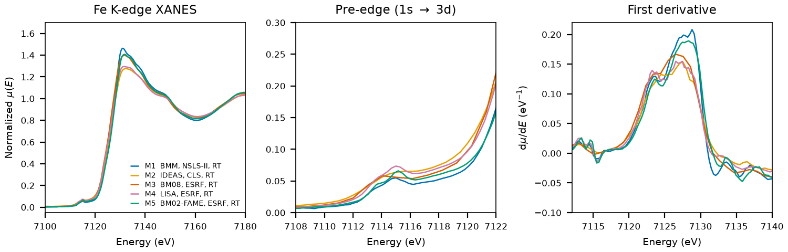

# Goethite ($\alpha$-FeO(OH))

## Overview

- **Mineral Name**: Goethite (IMA approved)
- **Chemical Formula**: $\alpha$-FeO(OH) or FeHO2 (Iron(III) oxide-hydroxide)
- **Fe Oxidation State**: Fe3+
- **Coordination Geometry**: Distorted octahedral (O:6, site symmetry $m$, 3 O and 3 OH ligands)
- **Symmetry-Inequivalent Fe Sites**: 1 (Wyckoff `4c` in $Pnma$)
- **Structure**: Diaspore-type orthorhombic crystal structure ($Pnma$, space group 62) with double chains of edge-sharing FeO3(OH)3 octahedra linked by hydrogen bonds.

---

## Recommended Spectrum for Comparison with Calculations

- For conventional XANES calculations, use `NIST/Fe-Goethite.xdi` (M1). It is the primary reference measurement combining raw $\mu$, a simultaneous Fe foil reference channel for absolute energy calibration ($7112.0\text{ eV}$), and a dense XANES grid ($0.30\text{ eV}$ step).

---

## Crystal Structures

### Materials Project

| File | MP ID | Space Group | Lattice Parameters | $d$(Fe-O) |
| :--- | :--- | :--- | :--- | :--- |
| `MP/mp-605437.cif` | `mp-605437` | $Pbnm$ (62) | $a = 4.6041\text{ \AA}, b = 9.9665\text{ \AA}, c = 3.0306\text{ \AA}$ | $2.0371\text{ \AA}$ |

Notes:

- At `symprec = 0.01` spglib gives the standard setting $Pnma$, which matches the experimental diaspore-type space group. The table uses the $Pbnm$ setting of the COD entries; the CIF file stores the axes as $a = 3.0306$, $b = 4.6041$, $c = 9.9665\text{ \AA}$.
- `MP/mp-605437.json` lists 6 ICSD codes: `109041`, `239321`, `239322`, `239323`, `239324`, `245057`. One of them (`245057`) corresponds to the COD entry below.

### Crystallography Open Database (COD) and ICSD Cross-References

| File | ICSD ID | Space Group | Lattice Parameters | $d$(Fe-O) | Reference |
| :--- | :--- | :--- | :--- | :--- | :--- |
| `COD/cod_2211652.cif` | `245057` | $Pbnm$ (62) | $a = 4.5979\text{ \AA}, b = 9.9510\text{ \AA}, c = 3.0178\text{ \AA}$ | $2.0261\text{ \AA}$ | Yang et al. (2006), *Acta Cryst. E* 62, i250 ($T = 273(2)\text{ K}$) |

Notes:

- Ambient-pressure end-member structure.
- `245057` carries the Yang (2006) $b$ and $c$ ($3.018$, $9.951\text{ \AA}$) in the AFLOW mirror (its $a$ is stored halved, $2.299\text{ \AA}$), and Yang et al. (2006) is in the MP provenance references. The Hazemann (1991) entry was removed: the paper is not an MP source (`239321` to `239324` are the Zepeda-Alarcon 2014 refinements).

---

## Experimental XAS Spectra

| ID | File (XASDB duplicate) | Source and date | $T$ | XANES step |
| :--- | :--- | :--- | :--- | :--- |
| M1 | `NIST/Fe-Goethite.xdi` (`XASDB/Goethite_idiwwqca.dat`) | BMM, NSLS-II, 2023 (Ravel) | RT | $0.30\text{ eV}$ |
| M2 | `XASDB/Goethite_idghzdol.dat` | IDEAS, CLS, 2022 (Blanchard et al.) | RT | $0.50\text{ eV}$ |
| M3 | `XASDB/Goethite_idsdehbq.dat` | BM08-GILDA, ESRF, 2007 (Puri) | RT | $1.04\text{ eV}$ |
| M4 | `XASDB/Goethite_id0t00uw.dat` | BM08-LISA, ESRF, 2025 (Puri) | RT | $0.30\text{ eV}$ |
| M5 | `FAME/EXPERIMENT_DT_20170706_005-SPECTRUM_DT_20170706_005/XAS_trans_FeOOH/XAS_trans_FeOOH.data.txt` | BM02-FAME, ESRF, 2016 (Testemale and Sanchez-Valle) | 293 K | $0.30\text{ eV}$ |
| M6 | `XASDB/Goethite_idjy1nr5.dat` | IDEAS, CLS, 2022 (Blanchard et al.) | RT | $0.50\text{ eV}$ |
| M7 | `XASDB/Goethite_idmrlvh2.dat` | IDEAS, CLS, 2022 (Blanchard et al.) | RT | $0.50\text{ eV}$ |
| M8 | `XASDB/Goethite_idvey9dz.dat` | BM08-GILDA, ESRF, 2007 (Puri) | RT | $0.24\text{ eV}$ |
| M9 | `XASDB/Goethite_mineral_idybmhmm.dat` | BM08-LISA, ESRF, 2018 (Puri) | RT | $1.20\text{ eV}$ |

Notes:

- Scans M6 and M7 replicate M2. M8 covers a narrow range (7000 to 7497 eV). M9 is a natural mineral with a white line about 2 eV above the other scans, but the 1.2 eV grid and missing foil channel leave the shift unresolved.
- `XASDB/Goethite_idiwwqca.dat`: XASDB copy of `NIST/Fe-Goethite.xdi` (same energy, $I_0$, $I_t$, $I_r$) plus a linearly rescaled `Mutrans` column.
- M1: Fe foil reference channel, derivative maximum $7111.6\text{ eV}$. Shift $+0.40\text{ eV}$ to put the foil at $7112.0\text{ eV}$. M8: foil derivative maximum $7111.8\text{ eV}$, shift $+0.2\text{ eV}$. M2, M3, M4, M6, M7: foil at $7112.0\text{ eV}$, so the axes are already calibrated (M3 on a 1 eV grid). M5: no foil channel; the same-day FAME foil (`Iron/FAME/EXPERIMENT_DT_20170706_006-SPECTRUM_DT_20170706_006`) has its derivative maximum at $7112.1\text{ eV}$, so the axis is good to $0.3\text{ eV}$.
- All transmission. M1: $\mu x \approx 1.5$, of which only $0.17$ comes from the thin powder on tape. M2 to M4 and M6 to M9: $\mu x \approx 0.7$ to $0.8$. M5: transmission in arbitrary units, averaged scans.
- Derivative maxima at $7124$ and $7128\text{ eV}$, the second higher (M1, shifted axis); pre-edge peak $7115.0\text{ eV}$. The `4c` site has no inversion center, so the weak pre-edge reflects the small distortion, not centrosymmetry.
- M5 (FAME) was measured on natural goethite mixed in a BN pellet (SSHADE dataset DOI: 10.26302/SSHADE/EXPERIMENT_DT_20170706_005). The lineshape agrees with M1.
