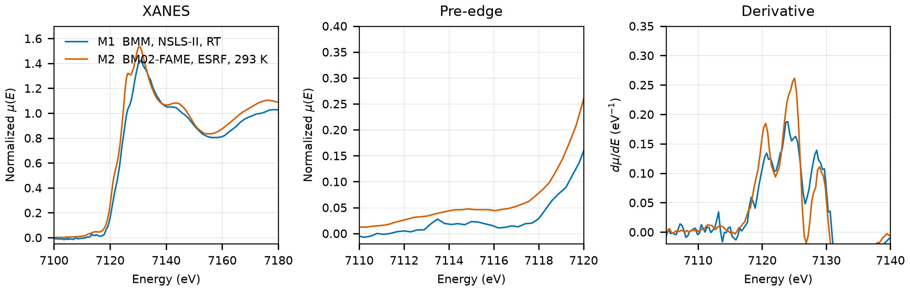

# Hedenbergite (CaFeSi2O6)

## Overview

- **Mineral Name**: Hedenbergite (IMA approved)
- **Chemical Formula**: CaFeSi2O6 (Calcium iron clinopyroxene)
- **Fe Oxidation State**: 2+
- **Coordination Geometry**: Distorted octahedral (O:6, site symmetry $2$)
- **Symmetry-Inequivalent Fe Sites**: 1 (Wyckoff `4e`, M1 site in $C2/c$), the same in every structure in this folder
- **Structure**: Single-chain inosilicate ($[\text{Si}_2\text{O}_6^{4-}]_n$) with edge-sharing octahedral chains (M1 site occupied by Fe2+) and 8-fold coordinated M2 sites occupied by Ca2+.

---

## Recommended Spectrum for Comparison with Calculations

- For conventional XANES calculations, use `NIST/Fe-Hedenbergite.xdi` (M1) for the energy axis: it has a simultaneous Fe foil reference channel and a $0.30\text{ eV}$ grid, but its edge step is only $0.04$. Check amplitudes against the FAME scan (M2), which has a full edge step but no foil channel.

---

## Crystal Structures

### Materials Project

| File | MP ID | Space Group | Lattice Parameters | $d$(Fe-O) |
| :--- | :--- | :--- | :--- | :--- |
| `MP/mp-18890.cif` | `mp-18890` | $C2/c$ (15) | $a = 9.9752\text{ \AA}, b = 9.1545\text{ \AA}, c = 5.3344\text{ \AA}, \beta = 105.38^\circ$ | $2.1186$ to $2.1935\text{ \AA}$ (mean $2.1599\text{ \AA}$) |

Notes:

- The monoclinic $C2/c$ symmetry of the CIF file matches the experimental clinopyroxene space group at `symprec = 0.01`.
- `MP/mp-18890.json` lists 27 ICSD codes: `10226`, `10227`, `10228`, `10229`, `10230`, `10231`, `83437`, `83438`, `83439`, `83440`, `83441`, `83442`, `83443`, `83444`, `83445`, `83446`, `83447`, `83448`, `156538`, `156539`, `156540`, `158138`, `159547`, `160809`, `160810`, `166320`, `246207`. Two of them (`156538`, `160809`) correspond to the COD entries below.
- The `material_id` field in `MP/mp-18890.json` reads `mp-aaaabbyo` (scrambled), so the file content itself does not confirm the `mp-18890` ID.

### Crystallography Open Database (COD) and ICSD Cross-References

| File | ICSD ID | Space Group | Lattice Parameters | $d$(Fe-O) | Reference |
| :--- | :--- | :--- | :--- | :--- | :--- |
| `COD/cod_9010072.cif` | `156538` | $C2/c$ (15) | $a = 9.8450\text{ \AA}, b = 9.0293\text{ \AA}, c = 5.2450\text{ \AA}, \beta = 104.78^\circ$ | $2.0862$ to $2.1622\text{ \AA}$ (mean $2.1289\text{ \AA}$) | Redhammer et al. (2006), *Am. Mineral.* 91, 1271 (synthetic, $T = 298\text{ K}$) |
| `COD/cod_9010468.cif` | `160809` | $C2/c$ (15) | $a = 9.8447\text{ \AA}, b = 9.0234\text{ \AA}, c = 5.2509\text{ \AA}, \beta = 104.86^\circ$ | $2.0906$ to $2.1652\text{ \AA}$ (mean $2.1310\text{ \AA}$) | Nestola et al. (2008), *Am. Mineral.* 93, 1005 (synthetic Jd0Hd100, $P = 0\text{ GPa}$) |

Notes:

- Both entries are ambient-condition end-member structures ($T \approx 298\text{ K}$, $P = 1\text{ atm}$). `cod_9010072.cif` records $T = 298\text{ K}$ and `cod_9010468.cif` $P = 0$ in the CIF tags; `cod_9010468.cif` is the ambient point of a high-pressure series.
- `156538` matches the Redhammer (2006) cell and Ca, Fe, Si coordinates ($V = 450.83\text{ \AA}^3$) and `160809` the Nestola (2008) cell and coordinates ($V = 450.85\text{ \AA}^3$) in the AFLOW mirror of the ICSD entries; both papers are in the MP provenance references. The Cameron (1973) 24 °C entry (`10226`, also verified) was removed as the oldest refinement.

---

## Experimental XAS Spectra

| ID | File (XASDB duplicate) | Source and date | $T$ | XANES step |
| :--- | :--- | :--- | :--- | :--- |
| M1 | `NIST/Fe-Hedenbergite.xdi` (`XASDB/Hedenbergite_idom107e.dat`) | BMM, NSLS-II, 2023 (Ravel) | RT | $0.30\text{ eV}$ |
| M2 | `FAME/EXPERIMENT_DT_20170706_004-SPECTRUM_DT_20170706_004/XAS_trans_CaFeSi2O6/XAS_trans_CaFeSi2O6.data.txt` | BM02-FAME, ESRF, 2016 (Testemale & Sanchez-Valle) | 293 K | $0.30\text{ eV}$ |

Notes:

- `XASDB/Hedenbergite_idom107e.dat`: XASDB copy of `NIST/Fe-Hedenbergite.xdi` (same energy, $I_0$, $I_t$, $I_r$) plus a min-max scaled `Mutrans` column.
- M1: Fe foil reference channel, derivative maximum $7111.6\text{ eV}$. Shift $+0.39\text{ eV}$ to put the foil at $7112.0\text{ eV}$. M2: no foil channel; the same-day FAME foil (`Iron/FAME/EXPERIMENT_DT_20170706_006-SPECTRUM_DT_20170706_006`) has its derivative maximum at $7112.1\text{ eV}$, so the axis is good to $0.3\text{ eV}$.
- Both transmission. M1: $\mu x \approx 1.5$, of which only $0.04$ comes from the sample (very dilute PEG pellet), so the XANES is weak. M2: $\mu x \approx 2.9$, transmission in arbitrary units, averaged scans.
- Derivative maxima at $7121$ and $7124\text{ eV}$ (M1, shifted axis; M2 $7121$ and $7125\text{ eV}$), the second higher; pre-edge peak $7113.5\text{ eV}$ (M1). The M1 site has no inversion center, so the weak pre-edge reflects the small distortion of the octahedron, not centrosymmetry.
- M1: PEG pellet, room temperature, sample courtesy of Martin Stennett (University of Sheffield). M2 (FAME) was measured on natural hedenbergite mixed in a BN pellet (SSHADE dataset DOI: 10.26302/SSHADE/EXPERIMENT_DT_20170706_004).
