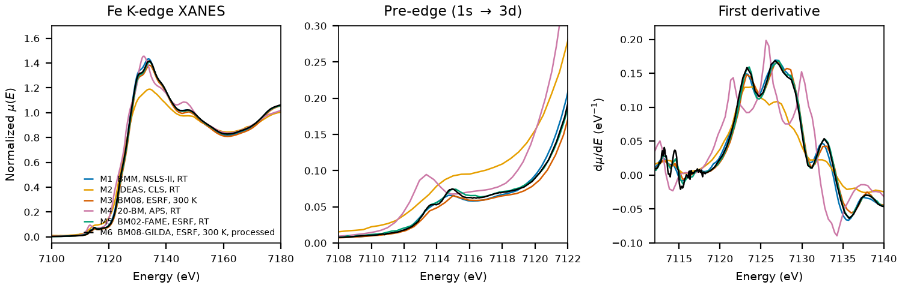

# Hematite ($\alpha$-Fe2O3)

## Overview

- **Mineral Name**: Hematite (IMA approved)
- **Chemical Formula**: $\alpha$-Fe2O3 (Iron(III) oxide)
- **Fe Oxidation State**: Fe3+
- **Coordination Geometry**: Distorted octahedral (O:6, site symmetry $3$, 3 short and 3 long Fe-O bonds)
- **Symmetry-Inequivalent Fe Sites**: 1 (Wyckoff `12c` in hexagonal setting, `4c` in rhombohedral setting)
- **Structure**: Corundum-type crystal structure ($R\bar{3}c$, space group 167) consisting of hexagonal close-packed oxygen atoms with two-thirds of the octahedral sites occupied by Fe3+ cations.

---

## Recommended Spectrum for Comparison with Calculations

- For conventional XANES calculations, use `NIST/Fe-Hematite.xdi` (M1). It is the best auditable reference because it retains raw $\mu$, a simultaneous Fe foil reference channel, and a $0.30\text{ eV}$ XANES grid.

---

## Crystal Structures

### Materials Project

| File | MP ID | Space Group | Lattice Parameters (Hexagonal) | $d$(Fe-O) |
| :--- | :--- | :--- | :--- | :--- |
| `MP/mp-19770.cif` | `mp-19770` | $R\bar{3}c$ (167) | $a = 5.0925\text{ \AA}, c = 13.7743\text{ \AA}$ | $1.9670$ to $2.1219\text{ \AA}$ (mean $2.0444\text{ \AA}$) |

Notes:

- The trigonal $R\bar{3}c$ symmetry of the CIF file matches the experimental corundum space group at `symprec = 0.01`. The CIF stores a 10-atom primitive cell; the table gives the hexagonal cell from the spglib standardization.
- `MP/mp-19770.json` lists 65 ICSD codes: `15840`, `22505`, `24004`, `24791`, `33643`, `40142`, `41541`, `43465`, `56372`, `64599`, `66756`, `71194`, `81248`, `82134`, `82135`, `82136`, `82137`, `82902`, `82903`, `82904`, `88417`, `88418`, `96069`, `96070`, `96071`, `96072`, `96073`, `96074`, `96075`, `96076`, `161283`, `161284`, `161285`, `161286`, `161287`, `161288`, `161289`, `161290`, `161291`, `161292`, `161293`, `161294`, `173653`, `173655`, `182839`, `182840`, `182841`, `182842`, `182843`, `182844`, `182845`, `182846`, `182847`, `182848`, `184766`, `201096`, `201097`, `201098`, `201099`, `201100`, `201101`, `245851`, `415251`, `633032`, `633039`. One of them (`15840`) corresponds to a COD entry below.

### Crystallography Open Database (COD) and ICSD Cross-References

| File | ICSD ID | Space Group | Lattice Parameters | $d$(Fe-O) | Reference |
| :--- | :--- | :--- | :--- | :--- | :--- |
| `COD/cod_2101167.cif` | not verified | $R\bar{3}c$ (167) | $a = 5.0355\text{ \AA}, c = 13.7471\text{ \AA}$ | $1.9443$ to $2.1136\text{ \AA}$ (mean $2.0290\text{ \AA}$) | Maslen et al. (1994), *Acta Cryst. B* 50, 435 |
| `COD/cod_9000139.cif` | `15840` | $R\bar{3}c$ (167) | $a = 5.0380\text{ \AA}, c = 13.7720\text{ \AA}$ | $1.9457$ to $2.1162\text{ \AA}$ (mean $2.0309\text{ \AA}$) | Blake et al. (1966), *Am. Mineral.* 51, 123 |

Notes:

- Entries are near-ambient end-member structures. Neither CIF records temperature or pressure; both papers report room temperature. `cod_2101167.cif` is synthetic, `cod_9000139.cif` is natural (Elba).
- `15840` matches the Blake (1966) cell and coordinates ($a = 5.038$, $c = 13.772\text{ \AA}$, $z_\text{Fe} = 0.3553$, $x_\text{O} = 0.3059$) in the AFLOW mirror, and the paper is in the MP provenance references. Maslen et al. (1994) is also in the MP provenance, but its ICSD ID could not be pinned down: `64599` is a different cell ($a = 5.0285\text{ \AA}$), and the Finger & Hazen cell that Maslen adopted ($a = 5.0355$, $c = 13.7471\text{ \AA}$) is shared by `40142`, `81248` and others whose coordinates differ from the COD file in the fifth decimal.

---

## Experimental XAS Spectra

| ID | File | Source and date | $T$ | XANES step |
| :--- | :--- | :--- | :--- | :--- |
| M1 | `NIST/Fe-Hematite.xdi` | BMM, NSLS-II, 2023 (Ravel) | RT | $0.30\text{ eV}$ |
| M2 | `XASDB/Hematite_idal8hze.dat` | IDEAS, CLS, 2022 (Blanchard et al.) | RT | $0.50\text{ eV}$ |
| M3 | `XASDB/Hematite_idjf3d2r.dat` | BM08-GILDA, ESRF, 2010 (Puri) | 300 K | $0.50\text{ eV}$ |
| M4 | `XASDB/Iron (III) Oxide_idgbfxgi.dat` | 20-BM-B, APS, 2001 (Newville) | RT | $0.41\text{ eV}$ |
| M5 | `FAME/EXPERIMENT_DT_20170706_002-SPECTRUM_DT_20170706_002/XAS_trans_Fe2O3/XAS_trans_Fe2O3.data.txt` | BM02-FAME, ESRF, 2016 (Testemale & Sanchez-Valle) | 293 K | $0.30\text{ eV}$ |
| - | `XASDB/Hematite_idlop9zu.dat` | IDEAS, CLS, 2022 (Blanchard et al.) | RT | $0.50\text{ eV}$ |
| - | `XASDB/Hematite_idslj4k7.dat` | BM08-GILDA, ESRF, 2004 (Puri) | 300 K | $0.08\text{ eV}$ |
| - | `XASDB/Hematite_id77z7dm.dat` | BM08-GILDA, ESRF, 2007 (Puri) | 300 K | $0.22\text{ eV}$ |
| - | `XASDB/Iron (III) Oxide_idzxbmxn.dat` | 20-BM-B, APS, 2011 | 10–300 K range in header | $0.15\text{ eV}$ |
| - | `XASDB/Iron (III) Oxide_idpm3p7c.dat` | 20-BM-B, APS, 2011 | 10–300 K range in header | $0.15\text{ eV}$ |
| - | `XASDB/Iron (III) Oxide_idvkgnjg.dat` | 20-BM-B, APS, 2011 | 10–300 K range in header | $0.15\text{ eV}$ |

Notes:

- `XASDB/Hematite_idm57nnr.dat`: XASDB copy of `NIST/Fe-Hematite.xdi` (same energy, $I_0$, $I_t$, $I_r$) plus a linearly rescaled `Mutrans` column.
- M1: Fe foil reference channel, derivative maximum $7111.6\text{ eV}$. Shift $+0.4\text{ eV}$ to put the foil at $7112.0\text{ eV}$. M2, `Hematite_idlop9zu.dat`, `Hematite_idslj4k7.dat`, `Hematite_id77z7dm.dat`: foil at $7112.0\text{ eV}$, so the axes are already calibrated. The three 2011 APS scans: foil at $7110.4$ to $7110.6\text{ eV}$, shift $+1.4$ to $+1.6\text{ eV}$. M5: no foil channel; the same-day FAME foil (`Iron/FAME/EXPERIMENT_DT_20170706_006-SPECTRUM_DT_20170706_006`) has its derivative maximum at $7112.1\text{ eV}$, so the axis is good to $0.3\text{ eV}$. M3: no foil channel and no same-day reference, axis unverified. M4: no foil channel; the 20-BM foil of the previous day (`Iron/XASLIB/Fe_metal_rt_02.xdi`) sits at $7111.5\text{ eV}$, but the white line of M4 lies $2\text{ eV}$ below the other scans, so the axis is unresolved.
- All transmission. M1: $\mu x \approx 2$, of which $0.4$ comes from the powder on tape. M2 and the other CLS scan: $\mu x \approx 0.9$. GILDA scans: $\mu x \approx 0.7$. M4: $\mu x \approx 1.9$. The 2011 APS scans: $\mu x \approx 0.9$ with an edge step of only $0.2$. M5: transmission in arbitrary units, averaged scans.
- Derivative maxima at $7123$ and $7127\text{ eV}$ (M1, shifted axis), the second slightly higher; pre-edge peak $7115.0\text{ eV}$. The $0.08\text{ eV}$ GILDA scan (`Hematite_idslj4k7.dat`) resolves the two crystal-field components at $7114.0$ and $7115.1\text{ eV}$.
- M5 (FAME) was measured on natural hematite mixed in a BN pellet (SSHADE dataset DOI: 10.26302/SSHADE/EXPERIMENT_DT_20170706_002). The lineshape agrees with M1.
