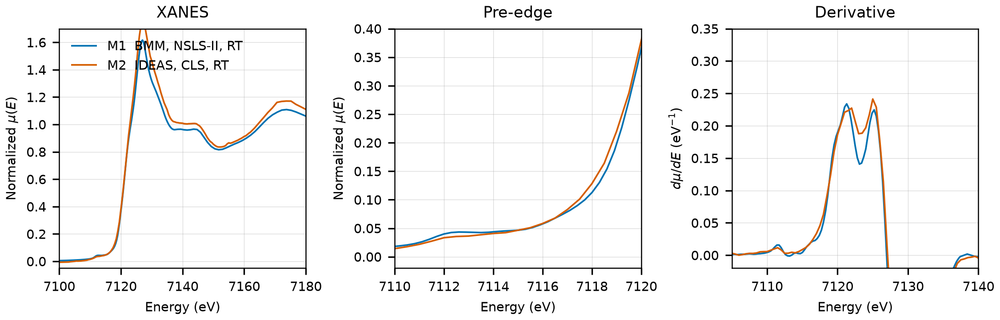

# Humboldtine (FeC2O4.2H2O)

## Overview

- **Mineral Name**: Humboldtine (IMA approved)
- **Chemical Formula**: FeC2O4.2H2O (Iron(II) oxalate dihydrate)
- **Fe Oxidation State**: 2+
- **Coordination Geometry**: Distorted octahedral ($4\text{ O}_{\text{ox}}, 2\text{ H}_2\text{O}$, site symmetry $2$)
- **Symmetry-Inequivalent Fe Sites**: 1 (Wyckoff `4e` in $C2/c$), the same in every structure in this folder
- **Structure**: Monoclinic crystal structure ($C2/c$, space group 15) consisting of linear chains of $\text{Fe}^{2+}$ cations bridged by bis-bidentate oxalate groups ($\text{C}_2\text{O}_4^{2-}$), with two trans-coordinated water molecules completing the coordination octahedron.

---

## Recommended Spectrum for Comparison with Calculations

- For conventional XANES calculations, use `NIST/Fe-Fe2Oxalate.xdi` (M1). It provides a transmission measurement with a simultaneous Fe foil reference channel for absolute energy calibration ($7112.0\text{ eV}$) and a $0.30\text{ eV}$ XANES grid.

---

## Crystal Structures

### Materials Project

| File | MP ID | Space Group | Lattice Parameters | $d$(Fe-O) |
| :--- | :--- | :--- | :--- | :--- |
| `MP/mp-698316.cif` | `mp-698316` | $C2/c$ (15)* | $a = 12.5906\text{ \AA}, b = 5.6606\text{ \AA}, c = 9.8109\text{ \AA}, \beta = 128.90^\circ$* | $2.1205$ to $2.1879\text{ \AA}$ (mean $2.1601\text{ \AA}$) |

Notes:

- At `symprec = 0.01` the DFT-relaxed cell is triclinic ($P1$, four Fe sites); at `symprec = 0.05` it refines to monoclinic $C2/c$ (15) with one Fe site on `4e`. The table gives the spglib standard cell at `symprec = 0.05`; in the same setting the COD cell is $a = 12.011$, $b = 5.557$, $c = 9.707\text{ \AA}$, $\beta = 126.92^\circ$, so the DFT cell is about $5\%$ longer along $a$.
- The `material_id` field in `MP/mp-698316.json` reads `mp-aaabntai` (scrambled), so the file content itself does not confirm the `mp-698316` ID.
- `MP/mp-698316.json` lists 3 ICSD codes: `109903`, `161344`, `164288`. One of them (`161344`) corresponds to the COD entry below.

### Crystallography Open Database (COD) and ICSD Cross-References

| File | ICSD ID | Space Group | Lattice Parameters | $d$(Fe-O) | Reference |
| :--- | :--- | :--- | :--- | :--- | :--- |
| `COD/cod_9017265.cif` | `161344` | $C2/c$ (15) | $a = 12.0110\text{ \AA}, b = 5.5570\text{ \AA}, c = 9.9200\text{ \AA}, \beta = 128.53^\circ$ | $2.1144$ to $2.1385\text{ \AA}$ (mean $2.1294\text{ \AA}$) | Echigo & Kimata (2008), *Phys. Chem. Miner.* 35, 467 (synthetic) |

Notes:

- Ambient-condition end-member structure ($T \approx 298\text{ K}$, $P = 1\text{ atm}$); the CIF has no temperature tag, room temperature comes from the paper. The H atoms are located.
- `161344` matches the Echigo & Kimata (2008) cell and Fe, C, O coordinates ($V = 517.96\text{ \AA}^3$, $y_\text{Fe} = 0.1704$) in the AFLOW mirror of the ICSD entry, and the paper is in the MP provenance references.

---

## Experimental XAS Spectra

| ID | File | Source and date | $T$ | XANES step |
| :--- | :--- | :--- | :--- | :--- |
| M1 | `NIST/Fe-Fe2Oxalate.xdi` | BMM, NSLS-II, 2023 (Ravel) | RT | $0.30\text{ eV}$ |
| M2 | `XASDB/Iron (II) Oxalate_idng95ys.dat` | IDEAS, CLS, 2023 (Blanchard et al.) | RT | $0.50\text{ eV}$ |

Notes:

- M1: Fe foil reference channel, derivative maximum $7111.6\text{ eV}$. Shift $+0.41\text{ eV}$ to put the foil at $7112.0\text{ eV}$. M2: foil at $7112.0\text{ eV}$, so the axis is already calibrated.
- Both transmission. M1: $\mu x \approx 2.5$. M2: $\mu x \approx 0.1$, a very thin sample.
- Two derivative maxima of equal height at $7121$ and $7125\text{ eV}$ (both files, shifted axis), so no single $E_0$; pre-edge plateau at $7112.5$ to $7113.5\text{ eV}$. The Fe site has no inversion center, so the weak pre-edge reflects the small distortion of the octahedron, not centrosymmetry.
- M1: PEG pellet, room temperature, sample courtesy of Martin Stennett (University of Sheffield).
- In M2 (`Iron (II) Oxalate_idng95ys.dat`), recalculate the absorption spectrum from the raw detector columns as $\mu(E) = \ln(I_0 / I_{trans})$ (columns 2 and 3), because the 5th column (`Mutrans`) is min-max scaled to $[0, 1]$.
