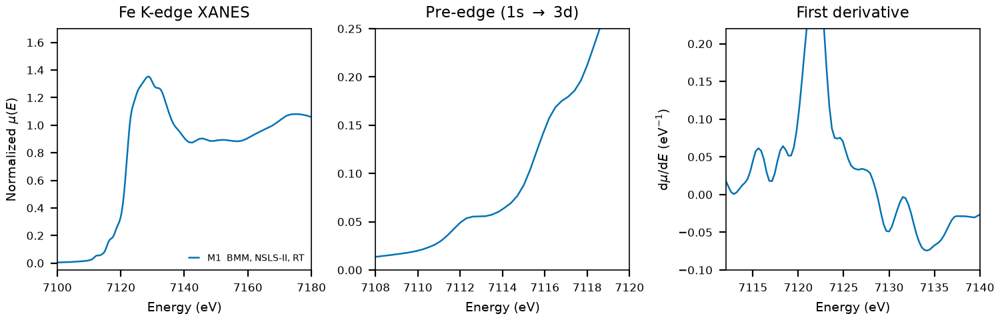

# Ilmenite (FeTiO3)

## Overview

- **Mineral Name**: Ilmenite (IMA approved)
- **Chemical Formula**: FeTiO3 (Iron(II) titanate)
- **Fe Oxidation State**: Fe2+
- **Coordination Geometry**: Trigonally distorted octahedral (O:6, site symmetry $3$)
- **Symmetry-Inequivalent Fe Sites**: 1 (Wyckoff `2c` in rhombohedral setting, `6c` in hexagonal setting)
- **Structure**: Ordered corundum-derivative structure ($R\bar{3}$, space group 148) with alternating layers of Fe2+ and Ti4+ occupying two-thirds of the octahedral sites in a hexagonal close-packed oxygen framework.

---

## Recommended Spectrum for Comparison with Calculations

- For conventional XANES calculations, use `NIST/Fe-Ilmenite.xdi` (M1). It is the primary reference measurement combining raw $\mu$, a simultaneous Fe foil reference channel for absolute energy calibration ($7112.0\text{ eV}$), and a dense XANES grid ($0.30\text{ eV}$ step).

---

## Crystal Structures

### Materials Project

| File | MP ID | Space Group | Lattice Parameters | $d$(Fe-O) |
| :--- | :--- | :--- | :--- | :--- |
| `MP/mp-19417.cif` | `mp-19417` | $R\bar{3}$ (148) | $a = 5.0866\text{ \AA}, c = 13.7470\text{ \AA}$ (hexagonal); $a = 5.4426\text{ \AA}, \alpha = 55.72^\circ$ (rhombohedral) | $2.0418$ to $2.1347\text{ \AA}$ (mean $2.0882\text{ \AA}$) |

Notes:

- The rhombohedral $R\bar{3}$ symmetry matches the ordered ilmenite space group at `symprec = 0.01`. The DFT cell is $2.4\%$ shorter along $c$ than the experimental one, which shortens $d$(Fe-O) by the same amount.
- `MP/mp-19417.json` lists 23 ICSD codes: `9805`, `24790`, `29209`, `30664`, `30665`, `30666`, `30667`, `30668`, `30669`, `30670`, `30671`, `30672`, `30673`, `43466`, `67046`, `153491`, `153492`, `153493`, `153494`, `153673`, `153674`, `187688`, `247547`. One of them (`30664`) corresponds to the COD entry below.

### Crystallography Open Database (COD) and ICSD Cross-References

| File | ICSD ID | Space Group | Lattice Parameters | $d$(Fe-O) | Reference |
| :--- | :--- | :--- | :--- | :--- | :--- |
| `COD/cod_9000906.cif` | `30664` | $R\bar{3}$ (148) | $a = 5.0884\text{ \AA}, c = 14.0855\text{ \AA}$ | $2.0778$ to $2.2013\text{ \AA}$ (mean $2.1395\text{ \AA}$) | Wechsler & Prewitt (1984), *Am. Mineral.* 69, 176 ($T = 24^\circ\text{C}$) |

Notes:

- Ambient-condition end-member structure ($T = 297.15\text{ K}$ in the CIF tag, $P = 1\text{ atm}$).
- `30664` matches the Wechsler & Prewitt (1984) cell and coordinates ($a = 5.0884$, $c = 14.0855\text{ \AA}$, $z_\text{Fe} = 0.35537$, $z_\text{Ti} = 0.1464$) in the AFLOW mirror, and the paper is in the MP provenance references. The Barth & Posnjak (1934) entry was removed.

---

## Experimental XAS Spectra

Two files, **one unique measurement**:

| ID | File (XASDB duplicate) | Source and date | $T$ | XANES step |
| :--- | :--- | :--- | :--- | :--- |
| M1 | `NIST/Fe-Ilmenite.xdi` (`XASDB/Ilmenite_idextn4w.dat`) | BMM, NSLS-II, 2023 (Ravel) | RT | $0.30\text{ eV}$ |

Notes:

- `XASDB/Ilmenite_idextn4w.dat`: XASDB copy of `NIST/Fe-Ilmenite.xdi` (same energy, $I_0$, $I_t$, $I_r$) plus a linearly rescaled `Mutrans` column.
- Fe foil reference channel, derivative maximum $7111.6\text{ eV}$. Shift $+0.41\text{ eV}$ to put the foil at $7112.0\text{ eV}$.
- Transmission, $\mu x \approx 3$.
- $E_0 = 7121.9\text{ eV}$ (derivative maximum, single peak, shifted axis). The $1s \rightarrow 3d$ transition is a shoulder on the rising edge near $7115\text{ eV}$ with no resolvable maximum, so no peak position is quoted.
- PEG pellet, room temperature, sample courtesy of Martin Stennett (University of Sheffield). The header does not say whether the specimen is natural or synthetic. Natural ilmenite commonly carries Mg, Mn, and hematite exsolution, and this is the only measurement in the folder, so no cross-laboratory check is possible.
