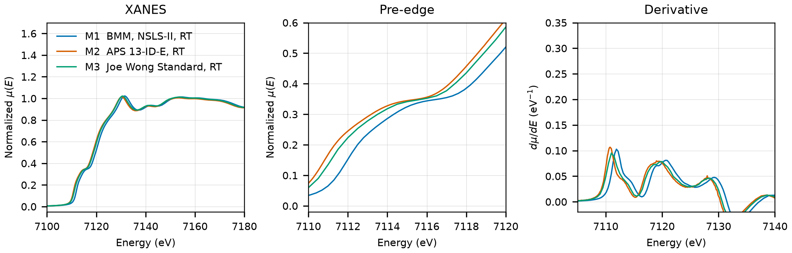

# Iron (Fe)

## Overview

- **Mineral Name**: Iron (Kamacite / $\alpha$-Fe, IMA approved)
- **Chemical Formula**: Fe (Elemental iron metal)
- **Fe Oxidation State**: 0
- **Coordination Geometry**: Body-centered cubic (Fe:8, site symmetry $m\bar{3}m$)
- **Symmetry-Inequivalent Fe Sites**: 1 (Wyckoff `2a` in $Im\bar{3}m$), the same in every structure in this folder
- **Structure**: Body-centered cubic crystal structure ($Im\bar{3}m$, space group 229) consisting of a centered cubic lattice of zero-valent Fe atoms with 8 nearest neighbors at distance $a\sqrt{3}/2$.

---

## Recommended Spectrum for Comparison with Calculations

- For conventional XANES and EXAFS calculations, use `NIST/Fe-K-IronFoil.xdi` (M1). It provides a high-resolution transmission measurement on standard Fe reference foil calibrated to the absolute inflection standard ($7112.0\text{ eV}$) with a $0.30\text{ eV}$ XANES grid.

---

## Crystal Structures

### Materials Project

| File | MP ID | Space Group | Lattice Parameters | $d$(Fe-Fe) |
| :--- | :--- | :--- | :--- | :--- |
| `MP/mp-13.cif` | `mp-13` | $Im\bar{3}m$ (229) | $a = 2.8630\text{ \AA}$ | $2.4778$ to $2.4811\text{ \AA}$ (mean $2.4795\text{ \AA}$) |

Notes:

- The body-centered cubic $Im\bar{3}m$ symmetry of the CIF file matches the experimental $\alpha\text{-Fe}$ space group at `symprec = 0.01`. The CIF stores a 2-atom cell; the table gives the cubic cell from the spglib standardization.
- The `material_id` field in `MP/mp-13.json` reads `mp-aaaaaaan` (scrambled), so the file content itself does not confirm the `mp-13` ID.
- `MP/mp-13.json` lists 31 ICSD codes: `44863`, `52258`, `53451`, `53452`, `53802`, `53804`, `64795`, `64998`, `64999`, `76747`, `159352`, `159353`, `159354`, `180969`, `180970`, `180971`, `181715`, `181758`, `183262`, `186832`, `191751`, `191830`, `426989`, `631722`, `631724`, `631727`, `631728`, `631729`, `631734`, `631736`, `633751`. The COD entry below has the same cell as `52258`, `53451` and `631736`.

### Crystallography Open Database (COD) and ICSD Cross-References

| File | ICSD ID | Space Group | Lattice Parameters | $d$(Fe-Fe) | Reference |
| :--- | :--- | :--- | :--- | :--- | :--- |
| `COD/cod_9008536.cif` | `52258` | $Im\bar{3}m$ (229) | $a = 2.8665\text{ \AA}$ | $2.4825\text{ \AA}$ | Wyckoff (1963), *Crystal Structures* 1, 7 ($T = 298\text{ K}$) |

Notes:

- Ambient-condition $\alpha$-Fe structure ($T = 298\text{ K}$ in the CIF tag, $P = 1\text{ atm}$).
- For bcc Fe the cell is the whole structure, and $a = 2.8665\text{ \AA}$ is the cell stored for `52258`, `53451` and `631736` in the AFLOW mirror. The Wyckoff compilation itself is not an MP source; the MP provenance cites the original lattice-parameter papers (Basinski 1955, Kohlhaas 1967, Swanson & Tatge 1955 and others). The Zhang (1999) entry was removed: the paper is not an MP source and `180969` is a different cell ($a = 2.869\text{ \AA}$).

---

## Experimental XAS Spectra

| ID | File | Source and date | $T$ | XANES step |
| :--- | :--- | :--- | :--- | :--- |
| M1 | `NIST/Fe-K-IronFoil.xdi` | BMM, NSLS-II, 2023 (Ravel) | RT | $0.30\text{ eV}$ |
| M2 | `XASLIB/Fe_Foil_rt_2016Foils_13IDE_01.xdi` | APS 13-ID-E, 2016 | RT | $0.10\text{ eV}$ |
| M3 | `XASLIB/Fe_metal_rt_01.xdi` | 13-BM-D, APS, 2002 (Joe Wong boxed-set foil) | RT | $0.50\text{ eV}$ |
| M4 | `XASLIB/Fe_metal_rt_02.xdi` | 20-BM-B, APS, 2001-08-09 | RT | $0.40\text{ eV}$ |
| M5 | `FAME/EXPERIMENT_DT_20170706_006-SPECTRUM_DT_20170706_006/XAS_trans_FeFoil_300K/XAS_trans_FeFoil_300K.data.txt` | BM02-FAME, ESRF, 2016-05-07 (Testemale & Sanchez-Valle) | 300 K | $0.30\text{ eV}$ |

Notes:

- M1: the foil sits in the reference position, so `xmu` is $\ln(I_t/I_r)$ and the sample channel is empty. Derivative maximum $7111.9\text{ eV}$.
- M2: the detector columns are inverted ($I_{trans}$ is column 2 and $I_0$ is column 3), so $\mu(E) = \ln(\text{column 3} / \text{column 2})$. Derivative maximum $7110.8\text{ eV}$, $1.1\text{ eV}$ below M1.
- M3, M4, M5: derivative maximum $7111.1$, $7111.5$ and $7112.1\text{ eV}$. M4 and M5 are the same-day references for the foil-less scans of other compounds (M4 for the 20-BM-B scans of 2001-08-10, M5 for the FAME scans of 2016-05-07).
- All transmission. $\mu x \approx 5$ (M1), $4$ (M2), $2.7$ (M3), $2.9$ (M4); M5 is transmission in arbitrary units, averaged scans.
- The centrosymmetric body-centered cubic environment (site symmetry $m\bar{3}m$ / $O_h$) exhibits metallic band structure and characteristic EXAFS oscillations extending above $7900\text{ eV}$.
