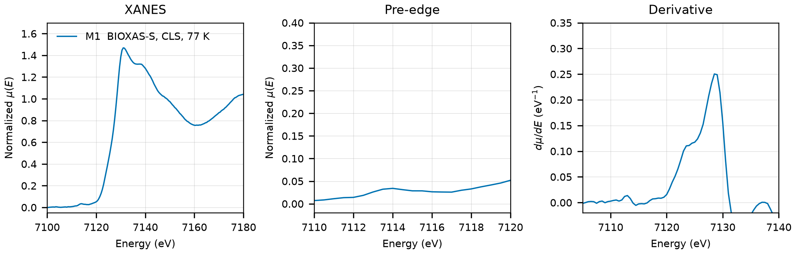

# Jarosite (KFe3(SO4)2(OH)6)

## Overview

- **Mineral Name**: Jarosite (IMA approved)
- **Chemical Formula**: KFe3(SO4)2(OH)6 (Potassium iron sulfate hydroxide)
- **Fe Oxidation State**: 3+
- **Coordination Geometry**: Octahedral (4 OH, 2 O, site symmetry $2/m$)
- **Symmetry-Inequivalent Fe Sites**: 1 (Wyckoff `9d` in $R\bar{3}m$), the same in every structure in this folder
- **Structure**: Rhombohedral alunite-jarosite crystal structure ($R\bar{3}m$, space group 166) consisting of corner-sharing $\text{Fe}(\text{OH})_4\text{O}_2$ octahedra forming kagome-like layers linked by sulfate tetrahedra and 12-coordinated $\text{K}^+$ cations.

---

## Recommended Spectrum for Comparison with Calculations

- For conventional XANES calculations, use `XASDB/Jarosite_ids1dc72.dat` (M1), the only measurement in the folder. It provides a transmission measurement at 77 K with a simultaneous Fe foil reference channel and a $0.50\text{ eV}$ XANES grid.

---

## Crystal Structures

### Materials Project

| File | MP ID | Space Group | Lattice Parameters (Hexagonal) | $d$(Fe-O) |
| :--- | :--- | :--- | :--- | :--- |
| `MP/mp-1192851.cif` | `mp-1192851` | $R\bar{3}m$ (166) | $a = 7.4155\text{ \AA}, c = 17.7083\text{ \AA}$ | $2.0175$ to $2.0838\text{ \AA}$ (mean $2.0396\text{ \AA}$) |

Notes:

- The rhombohedral $R\bar{3}m$ symmetry of the CIF file matches the experimental jarosite space group at `symprec = 0.01`. The CIF stores the rhombohedral primitive cell ($a = 7.292\text{ \AA}$, $\alpha = 61.12^\circ$); the table gives the hexagonal cell, which is $1.7\%$ larger in $a$ and $3\%$ in $c$ than the experimental one.
- The `material_id` field in `MP/mp-1192851.json` reads `mp-aaacpwox` (scrambled), so the file content itself does not confirm the `mp-1192851` ID.
- `MP/mp-1192851.json` lists 9 ICSD codes: `12107`, `158574`, `158575`, `189301`, `189302`, `189303`, `189304`, `189305`, `236980`. One of them (`189301`) corresponds to the COD entry below.

### Crystallography Open Database (COD) and ICSD Cross-References

| File | ICSD ID | Space Group | Lattice Parameters | $d$(Fe-O) | Reference |
| :--- | :--- | :--- | :--- | :--- | :--- |
| `COD/cod_1557931.cif` | `189301` | $R\bar{3}m$ (166) | $a = 7.2913\text{ \AA}, c = 17.1744\text{ \AA}$ | $1.9785$ to $2.0606\text{ \AA}$ (mean $2.0059\text{ \AA}$) | Mills et al. (2013), *Am. Mineral.* 98, 1966 ($T = 297\text{ K}$, $P = 100\text{ kPa}$) |

Notes:

- The COD file is the 297 K refinement of the Mills (2013) low-temperature series, not Nielsen (2007) as stated before; $T$ and $P$ are in the CIF tags. Its `_chemical_formula_sum` reads `F3 H6 K O14 S2`, a typo for Fe3; the atom list is correct.
- `189301` to `189305` are the five Mills (2013) temperatures in the AFLOW mirror of the ICSD entries; `189301` carries the 297 K $c$ ($17.174\text{ \AA}$) and the S and O1 coordinates ($z = 0.3086$, $0.6065$) of the COD file, but its $a$ is stored as $7.3913\text{ \AA}$, apparently a transcription error for $7.2913$. The paper is in the MP provenance references.

---

## Experimental XAS Spectra

| ID | File | Source and date | $T$ | XANES step |
| :--- | :--- | :--- | :--- | :--- |
| M1 | `XASDB/Jarosite_ids1dc72.dat` | BIOXAS-S, CLS, 2021 | 77 K | $0.50\text{ eV}$ |

Notes:

- Recalculate the absorption spectrum from the raw detector columns as $\mu(E) = \ln(I_0 / I_{trans})$ (columns 2 and 3), because the 5th column (`Mutrans`) is min-max scaled to $[0, 1]$. The header writes the column keys as `Column 1` instead of `Column.1`, so XDI parsers do not pick up the column names.
- Measured at 77 K on BIOXAS-S, not at room temperature.
- Fe foil reference channel, derivative maximum $7111.0\text{ eV}$. Shift $+1.0\text{ eV}$ to put the foil at $7112.0\text{ eV}$.
- Transmission, $\mu x \approx 0.3$, a thin sample.
- $E_0 = 7128.5\text{ eV}$ (derivative maximum, single peak, shifted axis); pre-edge peak $7114.0\text{ eV}$. The Fe site is centrosymmetric, hence the weak pre-edge.
