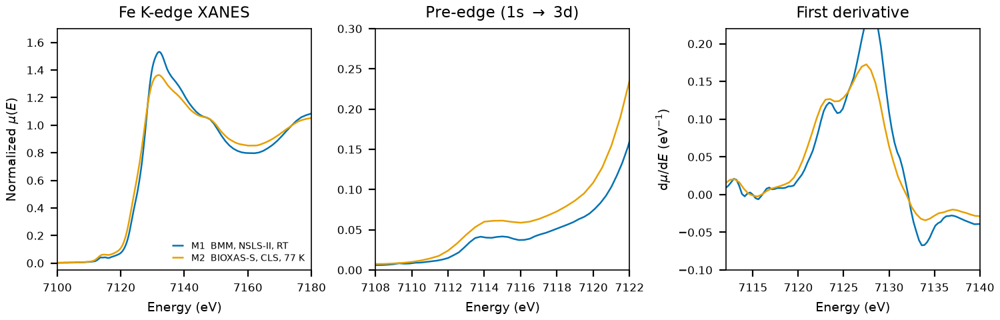

# Lepidocrocite ($\gamma$-FeO(OH))

## Overview

- **Mineral Name**: Lepidocrocite (IMA approved)
- **Chemical Formula**: $\gamma$-FeO(OH) or FeHO2 (Iron(III) oxide-hydroxide)
- **Fe Oxidation State**: Fe3+
- **Coordination Geometry**: Distorted octahedral (O:6, site symmetry $m2m$, 4 O and 2 OH ligands)
- **Symmetry-Inequivalent Fe Sites**: 1 (Wyckoff `4c` in $Cmcm$)
- **Structure**: Layered orthorhombic crystal structure ($Cmcm$, space group 63) composed of double layers of edge-sharing FeO6 octahedra linked across the interlayer region by hydrogen bonds.

---

## Recommended Spectrum for Comparison with Calculations

- For conventional XANES calculations, use `NIST/Fe-Lepidocrocite.xdi` (M1). It is the primary reference measurement combining raw $\mu$, a simultaneous Fe foil reference channel for absolute energy calibration ($7112.0\text{ eV}$), and a dense XANES grid ($0.30\text{ eV}$ step).

---

## Crystal Structures

### Materials Project

| File | MP ID | Space Group | Lattice Parameters | $d$(Fe-O) |
| :--- | :--- | :--- | :--- | :--- |
| `MP/mp-696580.cif` | `mp-696580` | $C2/m$ (12) | $a = 12.0060\text{ \AA}, b = 3.0955\text{ \AA}, c = 3.9095\text{ \AA}, \beta = 90.16^\circ$ | $1.9987$ to $2.1095\text{ \AA}$ (mean $2.0522\text{ \AA}$) |

Notes:

- At `symprec = 0.01`, the DFT-relaxed cell refines to monoclinic $C2/m$ (12) with $\beta = 90.16^\circ$ (Fe at Wyckoff $4i$, site symmetry $m$). It recovers the experimental $Cmcm$ (63) space group at `symprec = 0.05` or looser.
- `MP/mp-696580.json` lists 1 ICSD code: `24885`, which is Oleś et al. (1970), the only reference in the MP provenance.

### Crystallography Open Database (COD) and ICSD Cross-References

| File | ICSD ID | Space Group | Lattice Parameters | $d$(Fe-O) | Reference |
| :--- | :--- | :--- | :--- | :--- | :--- |
| `COD/cod_1011026.cif` | see note | $Amam$ (63) | $a = 3.8700\text{ \AA}, b = 12.5100\text{ \AA}, c = 3.0600\text{ \AA}$ | $1.9987$ to $2.0084\text{ \AA}$ (mean $2.0024\text{ \AA}$) | Ewing (1935), *J. Chem. Phys.* 3, 420 (natural, Eiserfeld, Germany) |

Notes:

- The MP source `24885` (Oleś 1970, neutron diffraction) uses the Ewing (1935) cell ($a = 3.06$, $b = 12.51$, $c = 3.87\text{ \AA}$) with refined coordinates ($y_\text{Fe} = 0.675$, $y_\text{O1} = 0.294$, $y_\text{O2} = 0.075$ in the AFLOW mirror) that differ from Ewing ($0.678$, $0.282$, $0.075$). Ewing (1935) itself is not an MP source, and COD has no Oleś entry, so this file is the closest available structure, not a verified ICSD match.
- The entry is an ambient-condition end-member structure ($T \approx 298\text{ K}$, $P = 1\text{ atm}$); the CIF has no temperature tag. The CIF uses the $Amam$ setting of space group 63 ($Cmcm$ with $a$ and $c$ exchanged); the H is a dummy atom (coordinates $-1, -1, -1$) that was not located.

---

## Experimental XAS Spectra

| ID | File (XASDB duplicate) | Source and date | $T$ | XANES step |
| :--- | :--- | :--- | :--- | :--- |
| M1 | `NIST/Fe-Lepidocrocite.xdi` (`XASDB/Lepidocrocite_idj58orc.dat`) | BMM, NSLS-II, 2023 (Ravel) | RT | $0.30\text{ eV}$ |
| M2 | `XASDB/Lepidocrocite_id49zit3.dat` | BIOXAS-S, CLS, 2021 (Vu et al.) | 77 K | $0.50\text{ eV}$ |
| M3 | `XASDB/Lepidocrocite_idzv0tk0.dat` | BIOXAS-S, CLS, 2021 (Vu et al.) | 77 K | $0.50\text{ eV}$ |
| M4 | `XASDB/Lepidocrocite_id5iy892.dat` | IDEAS, CLS, 2022 (Blanchard et al.) | RT | $0.50\text{ eV}$ |
| M5 | `XASDB/Lepidocrocite_idqwdiiw.dat` | IDEAS, CLS, 2022 (Blanchard et al.) | RT | $0.50\text{ eV}$ |

Notes:

- Scan M3 replicates M2. M4 and M5 form a second IDEAS pair.
- `XASDB/Lepidocrocite_idj58orc.dat`: XASDB copy of `NIST/Fe-Lepidocrocite.xdi` with the energy and detector columns rounded; here `Mutrans` equals `xmu`.
- M1: Fe foil reference channel, derivative maximum $7111.6\text{ eV}$. Shift $+0.4\text{ eV}$ to put the foil at $7112.0\text{ eV}$. M2 and M3: foil at $7111.0\text{ eV}$, shift $+1.0\text{ eV}$. M4 and M5: foil at $7112.0\text{ eV}$, so the axes are already calibrated.
- All transmission. M1: $\mu x \approx 1.6$, mostly from the tape. M2 and M3: $\ln(I_0/I_t)$ is negative because the chamber gains differ; the edge is intact. M4 and M5: $\mu x \approx 0.3$.
- $E_0 = 7127.9\text{ eV}$ (M1, derivative maximum, single peak, shifted axis); the CLS scans show two maxima at $7124$ and $7127.5\text{ eV}$. Pre-edge peak $7115.0\text{ eV}$ with a second component at $7113.8\text{ eV}$ of the same height.
- In the headers of M2 (`Lepidocrocite_id49zit3.dat`), column keys are written as `Column 1` instead of `Column.1`, so XDI parsers do not pick up the column names.
