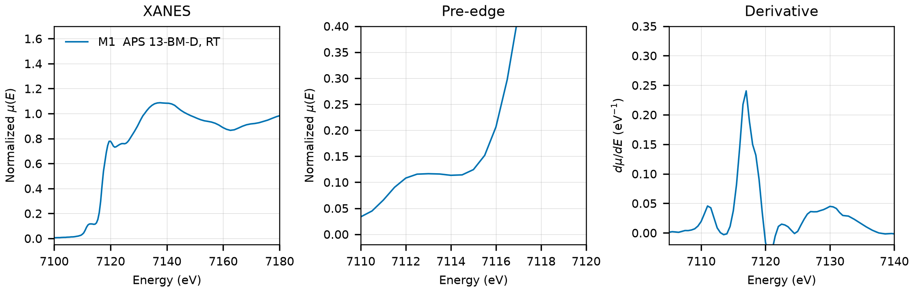

# Pyrite (FeS2)

## Overview

- **Mineral Name**: Pyrite (IMA approved)
- **Chemical Formula**: FeS2 (Iron disulfide)
- **Fe Oxidation State**: 2+
- **Coordination Geometry**: Octahedral (S:6, site symmetry $\bar{3}$)
- **Symmetry-Inequivalent Fe Sites**: 1 (Wyckoff `4a` in $Pa\bar{3}$), the same in every structure in this folder
- **Structure**: Cubic pyrite-type crystal structure ($Pa\bar{3}$, space group 205) consisting of a face-centered cubic arrangement of Fe2+ cations and $\text{S}_2^{2-}$ persulfide dumbbell pairs.

---

## Recommended Spectrum for Comparison with Calculations

- For conventional XANES calculations, use `XASLIB/FeS2_rt_01.xdi` (M1). It provides a transmission measurement with a $0.50\text{ eV}$ grid from $7092$ to $7132\text{ eV}$. Above $7132\text{ eV}$ the step grows from $0.9$ to $1.9\text{ eV}$ by $7200\text{ eV}$, so the upper XANES region is sampled coarsely.

---

## Crystal Structures

### Materials Project

| File | MP ID | Space Group | Lattice Parameters | $d$(Fe-S) |
| :--- | :--- | :--- | :--- | :--- |
| `MP/mp-226.cif` | `mp-226` | $Pa\bar{3}$ (205) | $a = 5.3968\text{ \AA}$ | $2.2563\text{ \AA}$ |

Notes:

- The cubic $Pa\bar{3}$ symmetry of the CIF file matches the experimental pyrite space group at `symprec = 0.01`.
- `MP/mp-226.json` lists 18 ICSD codes: `316`, `10422`, `15012`, `41995`, `43716`, `52372`, `53529`, `53935`, `109377`, `633254`, `633270`, `633273`, `633274`, `633287`, `633288`, `633289`, `633293`, `656511`. One of them (`15012`) corresponds to the COD entry below.

### Crystallography Open Database (COD) and ICSD Cross-References

| File | ICSD ID | Space Group | Lattice Parameters | $d$(Fe-S) | Reference |
| :--- | :--- | :--- | :--- | :--- | :--- |
| `COD/cod_5000115.cif` | `15012` | $Pa\bar{3}$ (205) | $a = 5.4179\text{ \AA}$ | $2.2624\text{ \AA}$ | Brostigen & Kjekshus (1969), *Acta Chem. Scand.* 23, 2186 ($T = 293\text{ K}$) |

Notes:

- Ambient-condition end-member structure ($T \approx 298\text{ K}$, $P = 1\text{ atm}$); the CIF has no temperature tag.
- `15012` matches the Brostigen & Kjekshus (1969) cell and S coordinate ($a = 5.4179\text{ \AA}$, $x = 0.384$) in the AFLOW mirror, and the paper is in the MP provenance references. The Fujii (1986) entry was removed (`53935` is a high-pressure point, $a = 5.39\text{ \AA}$, and the 1 atm refinement is not in the MP list). The Bayliss (1977) entry was removed because the COD file holds the cubic model while ICSD `10422` holds the triclinic $P1$ model of the same paper.

---

## Experimental XAS Spectra

Two files, **one unique measurement**:

| ID | File (XASDB duplicate) | Source and date | $T$ | XANES step |
| :--- | :--- | :--- | :--- | :--- |
| M1 | `XASLIB/FeS2_rt_01.xdi` (`XASDB/Pyrite_id621h02.dat`) | APS 13-BM-D, 2002 (Newville) | RT | $0.50\text{ eV}$ |

Notes:

- `XASDB/Pyrite_id621h02.dat`: XASDB copy of `XASLIB/FeS2_rt_01.xdi` plus a min-max scaled column.
- No reference channel and a nominal mono $d$ spacing. The same-day foil (`XASLIB/Fe_metal_rt_01.xdi`) has its derivative maximum at $7111.1\text{ eV}$, $0.5$ to $0.8\text{ eV}$ below the same estimate on calibrated foils ($7111.6$ on the BMM reference channels, $7111.9$ on `Iron/NIST/Fe-K-IronFoil.xdi`); same-day magnetite aligns onto `databases/NIST/Fe-Magnetite.xdi` within $0.3\text{ eV}$. Axis good to $\pm 0.5\text{ eV}$.
- Transmission, $\mu x \approx 1.3$.
- $E_0 = 7117.0\text{ eV}$ (derivative maximum, single peak); pre-edge plateau at $7112.5$ to $7113.5\text{ eV}$.
- Powder on tape, 4 layers, room temperature.
