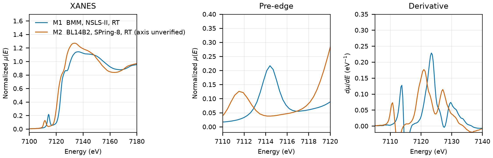

# Rodolicoite (FePO4)

## Overview

- **Mineral Name**: Rodolicoite (IMA approved)
- **Chemical Formula**: FePO4 (Iron(III) phosphate, $\alpha$-quartz homeotype)
- **Fe Oxidation State**: 3+
- **Coordination Geometry**: Tetrahedral (O:4, site symmetry $2$)
- **Symmetry-Inequivalent Fe Sites**: 1 (Wyckoff `3a` in $P3_1 21$), the same in every structure in this folder
- **Structure**: Trigonal $\alpha$-quartz-type crystal structure ($P3_1 21$, space group 152) consisting of a three-dimensional network of corner-sharing $\text{FeO}_4$ and $\text{PO}_4$ tetrahedra.

---

## Recommended Spectrum for Comparison with Calculations

- For conventional XANES calculations, use `NIST/Fe-IronPhosphate.xdi` (M1). It is the primary reference measurement combining raw $\mu$, a simultaneous Fe foil reference channel for absolute energy calibration ($7112.0\text{ eV}$), and a dense XANES grid ($0.30\text{ eV}$ step).
- `MDR/Fe-K_FePO4_Si111_50ms_200526.dat` (M2) is a second, independent measurement of a commercial sample on an unverified energy axis, with a weaker pre-edge; use it only as a cross-check (see the notes below).

---

## Crystal Structures

### Materials Project

| File | MP ID | Space Group | Lattice Parameters | $d$(Fe-O) |
| :--- | :--- | :--- | :--- | :--- |
| `MP/mp-19109.cif` | `mp-19109` | $P3_1 21$ (152) | $a = 5.0492\text{ \AA}, c = 11.2724\text{ \AA}$ | $1.8561$ to $1.8675\text{ \AA}$ (mean $1.8618\text{ \AA}$) |

Notes:

- The trigonal $P3_1 21$ symmetry of the CIF file matches the experimental rodolicoite space group at `symprec = 0.01`.
- `MP/mp-19109.json` lists 17 ICSD codes: `4266`, `38062`, `40863`, `40864`, `98063`, `98064`, `168184`, `168996`, `201794`, `201795`, `412734`, `412736`, `412737`, `412738`, `412739`, `412740`, `412741`. One of them (`38062`) corresponds to the COD entry below; `4266` (Ng & Calvo 1975) has the same cell with different coordinates.
- The `material_id` field in `MP/mp-19109.json` reads `mp-aaaabcgz` (scrambled, like the task IDs), so the file content itself does not confirm the `mp-19109` ID. The ID comes from the file name and the download provenance.

### Crystallography Open Database (COD) and ICSD Cross-References

| File | ICSD ID | Space Group | Lattice Parameters | $d$(Fe-O) | Reference |
| :--- | :--- | :--- | :--- | :--- | :--- |
| `COD/cod_9012512.cif` | `38062` | $P3_1 21$ (152) | $a = 5.0360\text{ \AA}, c = 11.2550\text{ \AA}$ | $1.8246$ to $1.8664\text{ \AA}$ (mean $1.8455\text{ \AA}$) | Long et al. (1983), *Inorg. Chem.* 22, 3012 (synthetic, neutron powder diffraction) |

Notes:

- The entry is an ambient-condition end-member structure ($T \approx 298\text{ K}$, $P = 1\text{ atm}$); the CIF has no temperature tag, room temperature comes from the paper.
- `38062` matches the Long (1983) cell and coordinates ($a = 5.036$, $c = 11.255\text{ \AA}$, $x_\text{Fe} = 0.4550$, $x_\text{P} = 0.4614$, O1 $0.4217, 0.3153$, O2 $0.4081, 0.2612$) in the AFLOW mirror, and the paper is in the MP provenance references.

---

## Experimental XAS Spectra

Three files, **two unique measurements**:

| ID | File (XASDB duplicate) | Source and date | $T$ | XANES step |
| :--- | :--- | :--- | :--- | :--- |
| M1 | `NIST/Fe-IronPhosphate.xdi` (`XASDB/Iron Phosphate_idux4tlj.dat`) | BMM, NSLS-II, 2023 (Ravel) | RT | $0.30\text{ eV}$ |
| M2 | `MDR/Fe-K_FePO4_Si111_50ms_200526.dat` (`MDR/Fe-K_FePO4_Si111_50ms_200526.txt`) | BL14B2, SPring-8, 2020-05-26 (JASRI standard sample database via MDR XAFS DB, DOI 10.48505/nims.2059) | RT | $0.36\text{ eV}$ |

Notes:

- `XASDB/Iron Phosphate_idux4tlj.dat`: XASDB copy of `NIST/Fe-IronPhosphate.xdi` with the energy and detector columns rounded; here `Mutrans` equals `xmu`.
- M1: Fe foil reference channel, derivative maximum $7111.6\text{ eV}$. Shift $+0.42\text{ eV}$ to put the foil at $7112.0\text{ eV}$.
- M1: transmission, powder on tape, $\mu x \approx 1.4$.
- M1: $E_0 = 7123.4\text{ eV}$ (derivative maximum, single main peak, shifted axis). The non-centrosymmetric tetrahedral $\text{FeO}_4$ site (site symmetry $2$ / $C_2$) enables strong $p$-$d$ mixing, hence the prominent pre-edge peak at $7114.4\text{ eV}$.
- M2: raw BL14B2 file with monochromator angle (columns `Angle(c)`, `Angle(o)`), dwell time, $I_0$ and $I_1$ counts; $E = hc / (2 d \sin\theta)$ with $d = 3.13551\text{ \AA}$ from the header and $\mu x = \ln(I_0/I_1)$, as in `spectra_comparison.py`. The `.txt` file is the same scan rebinned by the depositors to 619 points (Athena format); `MDR/metadata.all.yml` holds the deposit metadata (Merck EMSURE iron(III) phosphate, article 1.03935, lot B1332435).
- M2: no reference channel and no Fe foil from the same day. The energy axis is unverified; the only BL14B2 foil in the MDR database is from 2012 and sits $2.7\text{ eV}$ below $7112.0\text{ eV}$, and the M2 edge and pre-edge lie about $2.5\text{ eV}$ below those of M1 on the raw axis, so expect an offset of that size.
- M2: transmission, $\mu x \approx 0.4$ before the edge and $1.3$ after it.
- M2: $E_0 = 7121.0\text{ eV}$ (derivative maximum, single main peak, raw axis); pre-edge peak $7111.5\text{ eV}$. Relative to the edge the pre-edge and the $7136\text{ eV}$ maximum sit where they do in M1, but the pre-edge is about $40\%$ weaker and the shoulder at $7127\text{ eV}$ is absent, so the commercial sample is not pure quartz-type $\text{FePO}_4$ (some hydrated or amorphous octahedral $\text{Fe}^{3+}$ phosphate is likely). Use M1 as the reference.
