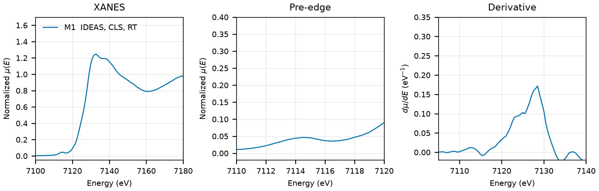

# Scorodite (FeAsO4.2H2O)

## Overview

- **Mineral Name**: Scorodite (IMA approved)
- **Chemical Formula**: FeAsO4.2H2O (Iron(III) arsenate dihydrate)
- **Fe Oxidation State**: 3+
- **Coordination Geometry**: Distorted octahedral (4 O, 2 H2O, site symmetry $1$)
- **Symmetry-Inequivalent Fe Sites**: 1 (Wyckoff `8c` in $Pbca$), the same in every structure in this folder
- **Structure**: Orthorhombic crystal structure ($Pbca$, space group 61) consisting of corner-sharing $\text{FeO}_4(\text{H}_2\text{O})_2$ octahedra and $\text{AsO}_4$ tetrahedra forming a cross-linked three-dimensional network.

---

## Recommended Spectrum for Comparison with Calculations

- For conventional XANES calculations, use `XASDB/Scorodite_id5bjue8.dat` (M1). It provides a transmission measurement with a simultaneous Fe foil reference channel for absolute energy calibration ($7112.0\text{ eV}$) and a $0.50\text{ eV}$ XANES grid.

---

## Crystal Structures

### Materials Project

| File | MP ID | Space Group | Lattice Parameters | $d$(Fe-O) |
| :--- | :--- | :--- | :--- | :--- |
| `MP/mp-543041.cif` | `mp-543041` | $Pbca$ (61) | $a = 9.0450\text{ \AA}, b = 10.1036\text{ \AA}, c = 10.5658\text{ \AA}$ | $1.9926$ to $2.1138\text{ \AA}$ (mean $2.0370\text{ \AA}$) |

Notes:

- The orthorhombic $Pbca$ symmetry of the CIF file matches the experimental scorodite space group at `symprec = 0.01`.
- The `material_id` field in `MP/mp-543041.json` reads `mp-aaabexif` (scrambled), so the file content itself does not confirm the `mp-543041` ID.
- `MP/mp-543041.json` lists 2 ICSD codes: `627`, `240964`. One of them (`240964`) corresponds to the COD entry below; `627` is Hawthorne (1976).

### Crystallography Open Database (COD) and ICSD Cross-References

| File | ICSD ID | Space Group | Lattice Parameters | $d$(Fe-O) | Reference |
| :--- | :--- | :--- | :--- | :--- | :--- |
| `COD/cod_2212542.cif` | `240964` | $Pbca$ (61) | $a = 8.9420\text{ \AA}, b = 10.0750\text{ \AA}, c = 10.3390\text{ \AA}$ | $1.9520$ to $2.1163\text{ \AA}$ (mean $2.0108\text{ \AA}$) | Xu et al. (2007), *Acta Cryst. E* 63, i67 (synthetic, $T = 293(2)\text{ K}$) |

Notes:

- Ambient-condition end-member structure ($T = 293(2)\text{ K}$ in the CIF tag, $P = 1\text{ atm}$). The COD file is the Xu (2007) redetermination, not Majzlan (2004) as stated before. The H atoms are located.
- Neither ICSD entry is mirrored in AFLOW. The MP provenance lists exactly two references, Hawthorne (1976) and Xu (2007), matching the two IDs `627` and `240964`, so `240964` is the Xu (2007) entry by elimination.

---

## Experimental XAS Spectra

| ID | File | Source and date | $T$ | XANES step |
| :--- | :--- | :--- | :--- | :--- |
| M1 | `XASDB/Scorodite_id5bjue8.dat` | IDEAS, CLS, 2019 (Blanchard et al.) | RT | $0.50\text{ eV}$ |

Notes:

- Recalculate the absorption spectrum from the raw detector columns as $\mu(E) = \ln(I_0 / I_{trans})$ (columns 2 and 3), because the 5th column (`Mutrans`) is min-max scaled to $[0, 1]$.
- Fe foil reference channel, derivative maximum $7112.0\text{ eV}$, so the axis is already calibrated.
- Transmission, $\mu x \approx 0.9$.
- Derivative maxima at $7125$ and $7128.5\text{ eV}$, the second higher; pre-edge peak $7114.5\text{ eV}$. The Fe site has no symmetry element, hence the visible pre-edge.
