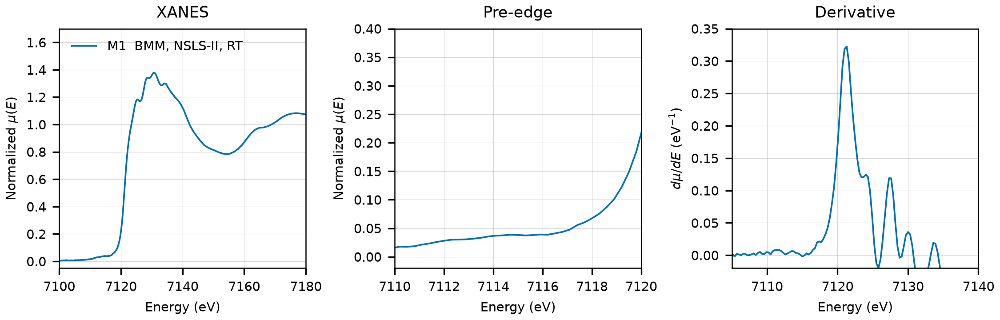

# Scorzalite (FeAl2(PO4)2(OH)2)

## Overview

- **Mineral Name**: Scorzalite (IMA approved)
- **Chemical Formula**: FeAl2(PO4)2(OH)2 (Iron aluminum phosphate hydroxide)
- **Fe Oxidation State**: 2+
- **Coordination Geometry**: Distorted octahedral (O:6, site symmetry $\bar{1}$)
- **Symmetry-Inequivalent Fe Sites**: 1 (Wyckoff `2a` in $P2_1/c$)
- **Structure**: Monoclinic lazulite-type crystal structure ($P2_1/c$, space group 14) consisting of face-sharing octahedral dimers linked by $\text{PO}_4$ tetrahedra.

---

## Recommended Spectrum for Comparison with Calculations

- For conventional XANES calculations, use `NIST/Fe-Scorzalite.xdi` (M1). It provides a transmission measurement with a simultaneous Fe foil reference channel for absolute energy calibration ($7112.0\text{ eV}$) and a $0.30\text{ eV}$ XANES grid.

---

## Crystal Structures

### Materials Project

The Materials Project has no scorzalite entry. `mp-1199432`, which was stored here before, is paravauxite $\text{FeAl}_2(\text{PO}_4)_2(\text{OH})_2 \cdot 8\text{H}_2\text{O}$ (Baur 1969, ICSD `24456`, formula Al2FeP2H18O18), not scorzalite, and was removed. The three MP entries in the Al-Fe-H-O-P system are all paravauxite-type.

### Crystallography Open Database (COD) and ICSD Cross-References

| File | ICSD ID | Space Group | Lattice Parameters | $d$(Fe-O) | Reference |
| :--- | :--- | :--- | :--- | :--- | :--- |
| `COD/cod_9007451.cif` | none in MP | $P2_1/c$ (14) | $a = 7.1500\text{ \AA}, b = 7.3100\text{ \AA}, c = 7.2500\text{ \AA}, \beta = 120.58^\circ$ | $2.0059$ to $2.0436\text{ \AA}$ (mean $2.0262\text{ \AA}$) | Lindberg & Christ (1959), *Acta Cryst.* 12, 695 |

Notes:

- The only scorzalite structure in COD. It is a 1959 photographic refinement with three-decimal coordinates and isotropic displacement parameters; COD also holds the same refinement with the measured composition $\text{Fe}_{0.77}\text{Mg}_{0.23}$ (`cod_1542135`). The CIF has no temperature tag. No ICSD entry can be linked to the Materials Project because MP has no scorzalite.

---

## Experimental XAS Spectra

| ID | File (XASDB duplicate) | Source and date | $T$ | XANES step |
| :--- | :--- | :--- | :--- | :--- |
| M1 | `NIST/Fe-Scorzalite.xdi` (`XASDB/Scorzalite_idcgeh2i.dat`) | BMM, NSLS-II, 2023 (Ravel) | RT | $0.30\text{ eV}$ |

Notes:

- `XASDB/Scorzalite_idcgeh2i.dat`: XASDB copy of `NIST/Fe-Scorzalite.xdi` (same energy, $I_0$, $I_t$, $I_r$) plus a min-max scaled `Mutrans` column.
- The XDI header names the sample `(Fe,Mg)Al2(OH,PO4)2`, a natural scorzalite with Mg substitution.
- Fe foil reference channel, derivative maximum $7111.6\text{ eV}$. Shift $+0.40\text{ eV}$ to put the foil at $7112.0\text{ eV}$.
- Transmission, $\mu x \approx 1.4$, of which only $0.15$ comes from the sample.
- $E_0 = 7121.3\text{ eV}$ (derivative maximum, single peak, shifted axis). The pre-edge is a weak shoulder between $7112$ and $7116\text{ eV}$ with no resolved maximum, as expected for the centrosymmetric site.
- PEG pellet, room temperature, sample courtesy of Martin Stennett (University of Sheffield).
