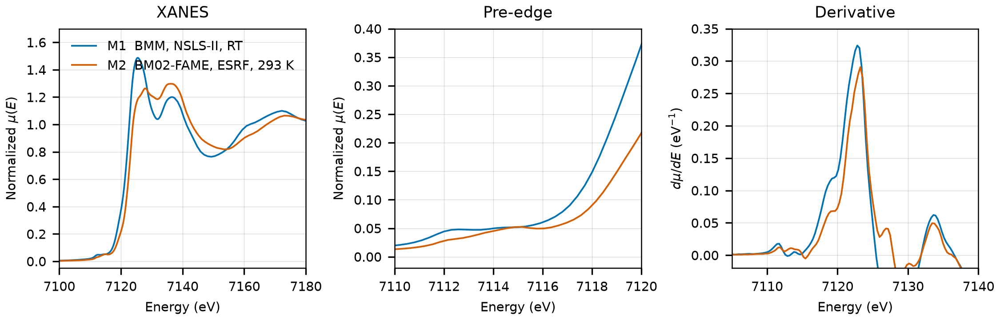

# Siderite (FeCO3)

## Overview

- **Mineral Name**: Siderite (IMA approved)
- **Chemical Formula**: FeCO3 (Iron(II) carbonate)
- **Fe Oxidation State**: 2+
- **Coordination Geometry**: Octahedral (O:6, site symmetry $\bar{3}$)
- **Symmetry-Inequivalent Fe Sites**: 1 (Wyckoff `6b` in $R\bar{3}c$), the same in every structure in this folder
- **Structure**: Calcite-type rhombohedral crystal structure ($R\bar{3}c$, space group 167) consisting of alternating layers of corner-sharing $\text{FeO}_6$ octahedra and planar $\text{CO}_3^{2-}$ carbonate groups.

---

## Recommended Spectrum for Comparison with Calculations

- For conventional XANES calculations, use `NIST/Fe-Siderite.xdi` (M1). It provides a transmission measurement with a simultaneous Fe foil reference channel for absolute energy calibration ($7112.0\text{ eV}$) and a $0.30\text{ eV}$ XANES grid.

---

## Crystal Structures

### Materials Project

| File | MP ID | Space Group | Lattice Parameters | $d$(Fe-O) |
| :--- | :--- | :--- | :--- | :--- |
| `MP/mp-18969.cif` | `mp-18969` | $R\bar{3}c$ (167) | $a = 4.7002\text{ \AA}, c = 14.9673\text{ \AA}$ | $2.1261\text{ \AA}$ |

Notes:

- The rhombohedral $R\bar{3}c$ symmetry of the CIF file matches the experimental siderite space group at `symprec = 0.01`. The DFT cell is $2.7\%$ shorter along $c$ than the experimental one.
- The `material_id` field in `MP/mp-18969.json` reads `mp-aaaabcbp` (scrambled), so the file content itself does not confirm the `mp-18969` ID.
- `MP/mp-18969.json` lists 12 ICSD codes: `100678`, `169789`, `169790`, `169791`, `169792`, `169793`, `169794`, `169795`, `169796`, `169797`, `169798`, `182821`. One of them (`100678`) corresponds to the COD entry below.

### Crystallography Open Database (COD) and ICSD Cross-References

| File | ICSD ID | Space Group | Lattice Parameters | $d$(Fe-O) | Reference |
| :--- | :--- | :--- | :--- | :--- | :--- |
| `COD/cod_5000036.cif` | `100678` | $R\bar{3}c$ (167) | $a = 4.6916\text{ \AA}, c = 15.3796\text{ \AA}$ | $2.1444\text{ \AA}$ | Effenberger et al. (1981), *Z. Kristallogr.* 156, 233 |

Notes:

- Ambient-condition end-member structure ($T \approx 298\text{ K}$, $P = 1\text{ atm}$); the CIF has no temperature tag, room temperature comes from the paper.
- `100678` matches the Effenberger (1981) cell and O coordinate ($a = 4.6916$, $c = 15.3796\text{ \AA}$, $x_\text{O} = 0.2743$) in the AFLOW mirror of the ICSD entry, and the paper is in the MP provenance references. The Elliot (2010) entry was removed: it is the siderite secondary phase of the pyrrhotite 5C refinement with the Effenberger O coordinate fixed, and no ICSD entry in the MP list has its cell.

---

## Experimental XAS Spectra

| ID | File | Source and date | $T$ | XANES step |
| :--- | :--- | :--- | :--- | :--- |
| M1 | `NIST/Fe-Siderite.xdi` | BMM, NSLS-II, 2023 (Ravel) | RT | $0.30\text{ eV}$ |
| M2 | `FAME/EXPERIMENT_DT_20170706_001-SPECTRUM_DT_20170706_001/XAS_trans_FeCO3/XAS_trans_FeCO3.data.txt` | BM02-FAME, ESRF, 2016 (Testemale & Sanchez-Valle) | 293 K | $0.30\text{ eV}$ |
| M3 | `XASDB/Siderite_iddujsej.dat` | IDEAS, CLS, 2022 (Blanchard et al.) | RT | $0.50\text{ eV}$ |

Notes:

- `XASDB/Siderite_iddujsej.dat` is not a copy of the NIST scan but an independent IDEAS measurement (M3); its `Mutrans` column is min-max scaled, so compute $\mu(E) = \ln(I_0 / I_{trans})$ from columns 2 and 3.
- M1: Fe foil reference channel, derivative maximum $7111.6\text{ eV}$. Shift $+0.41\text{ eV}$ to put the foil at $7112.0\text{ eV}$. M3: foil at $7112.0\text{ eV}$, so the axis is already calibrated. M2: no foil channel; the same-day FAME foil (`Iron/FAME/EXPERIMENT_DT_20170706_006-SPECTRUM_DT_20170706_006`) has its derivative maximum at $7112.1\text{ eV}$, so the axis is good to $0.3\text{ eV}$.
- All transmission. M1: $\mu x \approx 3$. M2: $\mu x \approx 2$, transmission in arbitrary units, averaged scans; its white line is much weaker than in M1 ($1.25$ against $1.5$ normalized), so use M1 for amplitudes. M3: $\mu x \approx 0.1$, a very thin sample.
- $E_0 = 7122.8\text{ eV}$ (M1, derivative maximum, single peak, shifted axis; M2 $7123.3$, M3 $7122.5\text{ eV}$); pre-edge plateau at $7112.3$ to $7113.5\text{ eV}$ (M1). The Fe site is centrosymmetric, hence the weak pre-edge.
- M1: PEG pellet, room temperature, sample courtesy of Martin Stennett (University of Sheffield). M2 (FAME) was measured on natural siderite mixed in a BN pellet (SSHADE dataset DOI: 10.26302/SSHADE/EXPERIMENT_DT_20170706_001).
