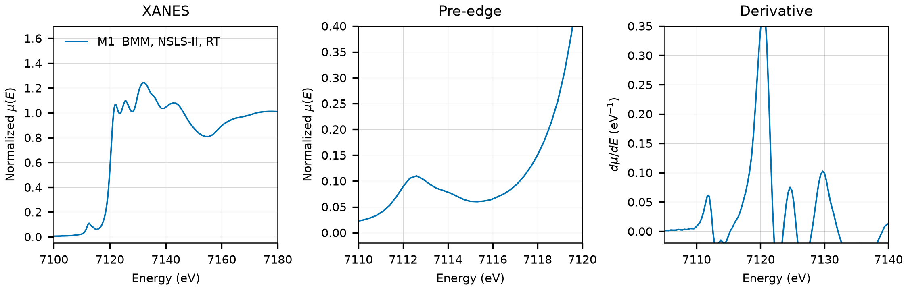

# Staurolite (Fe2Al9Si4O23(OH))

## Overview

- **Mineral Name**: Staurolite (IMA approved)
- **Chemical Formula**: Fe2Al9Si4O23(OH), or Fe2Al9Si4HO24 (iron aluminium nesosilicate hydroxide, ideal end-member)
- **Fe Oxidation State**: 2+
- **Coordination Geometry**: Tetrahedral (O:4, site symmetry $m$)
- **Symmetry-Inequivalent Fe Sites**: 1 (Wyckoff `4i`, the T2 site in $C2/m$), the same in every structure in this folder
- **Structure**: Monoclinic, pseudo-orthorhombic staurolite structure ($C2/m$, space group 12, $\beta \approx 90^\circ$) made of kyanite-like layers of $\text{AlO}_6$ octahedra and $\text{SiO}_4$ tetrahedra alternating along $b$ with $\text{Fe}$-$\text{Al}$-$\text{OH}$ layers, in which $\text{Fe}^{2+}$ occupies the T2 tetrahedron.

---

## Recommended Spectrum for Comparison with Calculations

- For conventional XANES calculations, use `NIST/Fe-Staurolite.xdi` (M1), the only measurement in the folder. It combines raw $\mu$, a simultaneous Fe foil reference channel, and a $0.30\text{ eV}$ XANES grid.
- Both structures in this folder are the ordered ideal end-member with Fe only on T2. In natural staurolite about 80 to 90% of the Fe sits on T2 and the rest on the octahedral M4, M1 and M2 sites (Hawthorne et al. 1993, *Can. Mineral.* 31, 551); the sample measured here is natural.

---

## Crystal Structures

### Materials Project

| File | MP ID | Space Group | Lattice Parameters | $d$(Fe-O) |
| :--- | :--- | :--- | :--- | :--- |
| `MP/mp-744386.cif` | `mp-744386` | $C2/m$ (12) | $a = 7.8003\text{ \AA}, b = 16.8167\text{ \AA}, c = 5.7821\text{ \AA}, \beta = 91.04^\circ$ | $2.0532$ to $2.0966\text{ \AA}$ (mean $2.0836\text{ \AA}$) |

Notes:

- The monoclinic $C2/m$ symmetry of the CIF file matches the experimental staurolite space group at `symprec = 0.01` (and at 0.05 and 0.1), with Fe on `4i` (site symmetry $m$). The CIF stores the 40-atom primitive cell; the table gives the spglib conventional cell. `MP/mp-744386.json` puts the structure $0.063\text{ eV/atom}$ above the hull (`is_stable: false`).
- The DFT cell is $1.8\%$ longer in $b$ and $2.7\%$ in $c$ than the COD entry, and the Fe-O distances are $0.10\text{ \AA}$ longer. The H atom sits midway between two O atoms ($d(\text{O-H}) = 1.40\text{ \AA}$), inherited from the idealized position of the 1958 model.
- `MP/mp-744386.json` lists 1 ICSD code: `16769`, which corresponds to the COD entry below.
- The `material_id` field in `MP/mp-744386.json` reads `mp-aaabqjeg` (scrambled), so the file content itself does not confirm the `mp-744386` ID.

### Crystallography Open Database (COD) and ICSD Cross-References

| File | ICSD ID | Space Group | Lattice Parameters | $d$(Fe-O) | Reference |
| :--- | :--- | :--- | :--- | :--- | :--- |
| `COD/cod_2310641.cif` | `16769` | $C2/m$ (12) | $a = 7.82\text{ \AA}, b = 16.52\text{ \AA}, c = 5.63\text{ \AA}, \beta = 90.1^\circ$ | $1.9578$ to $2.0058\text{ \AA}$ (mean $1.9809\text{ \AA}$) | Náray-Szabó & Sasvári (1958), *Acta Cryst.* 11, 862 |

Notes:

- The only ordered staurolite structure with the ideal formula in COD: Fe on `4i` with full occupancy, two- to three-decimal coordinates, no displacement parameters and no temperature tag (room temperature from the paper). The H atom is placed on the `2d` site ($0, 0, 1/2$).
- `16769` matches the Náray-Szabó (1958) cell and coordinates in the AFLOW mirror ($a = 7.82$, $b/a = 2.1125$, $c/a = 0.7199$, Fe at $x = 0.389$, $z = 3/4$ in the AFLOW setting), and the paper is the only structure reference in the MP provenance.
- The other staurolite entries in COD (some 70, Hawthorne 1993, Caucia 1994, Comodi 2002 and others) are refinements of natural crystals with Fe spread over T2, M4, M1 and M2 and partial occupancies; none is ordered or linked to an MP entry. `cod_9002795.cif` (Comodi 2002) was removed from `databases/` for that reason; its AMCSD copy also carries an implausible M4 iron occupancy of 0.84.

---

## Experimental XAS Spectra

| ID | File | Source and date | $T$ | XANES step |
| :--- | :--- | :--- | :--- | :--- |
| M1 | `NIST/Fe-Staurolite.xdi` | BMM, NSLS-II, 2023-05-05 (Ravel) | RT | $0.30\text{ eV}$ |

Notes:

- Fe foil reference channel, derivative maximum $7111.6\text{ eV}$. Shift $+0.41\text{ eV}$ to put the foil at $7112.0\text{ eV}$.
- Transmission, $\mu x \approx 2.7$, of which only $0.3$ comes from the sample.
- $E_0 = 7120.4\text{ eV}$ (derivative maximum, single main peak, shifted axis); pre-edge peak $7112.6\text{ eV}$. The tetrahedral site has no inversion center, hence the strong pre-edge for $\text{Fe}^{2+}$.
- PEG pellet, room temperature, sample courtesy of Martin Stennett (University of Sheffield). The header gives the formula `Fe2Al9O6(SiO4)4(O,OH)2`; the specimen is natural, so some Fe sits on the octahedral sites and Mg, Zn, Li and Mn substitute on T2.
