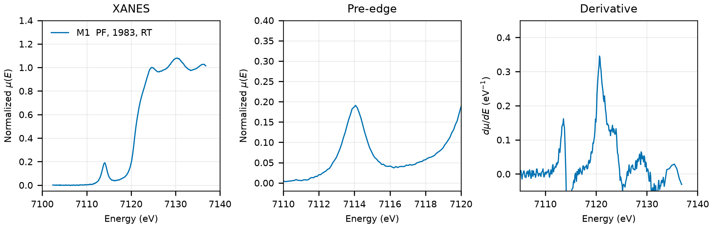

# Tetrachloroferrate ([N(C2H5)4][FeCl4])

## Overview

- **Compound Name**: Tetraethylammonium tetrachloroferrate(III), synthetic (CAS 14240-75-6)
- **Chemical Formula**: [N(C2H5)4][FeCl4], or C8H20Cl4FeN
- **Fe Oxidation State**: 3+
- **Coordination Geometry**: Tetrahedral (Cl:4, site symmetry $3m$ in the room-temperature phase)
- **Symmetry-Inequivalent Fe Sites**: 1 (Wyckoff `2a` in $P6_3mc$ at room temperature; `4a` in the $Pca2_1$ low-temperature phase), the same in every structure in this folder
- **Structure**: Molecular salt of isolated $\text{FeCl}_4^-$ tetrahedra and $\text{N}(\text{C}_2\text{H}_5)_4^+$ cations. The room-temperature phase is hexagonal ($P6_3mc$, space group 186) with the anion on the threefold axis (one axial and three equatorial Cl) and an orientationally disordered cation; on cooling the salt transforms via a $P6_3$ phase (230 K structure) to the ordered orthorhombic $Pca2_1$ phase (space group 29, 170 K and 110 K structures).

---

## Recommended Spectrum for Comparison with Calculations

- For conventional XANES calculations, use `MDR/K_NC2H54FeCl4_Si311_19831201.txt` (M1), the only measurement in the folder. It is a 1983 Photon Factory transmission scan that ends $25\text{ eV}$ above the edge, with a separate Fe foil scan from the same day for the energy axis.
- For the structure at the measurement temperature, use `COD/cod_2019519.cif` (290 K). The MP entry and `COD/cod_2019522.cif` are the 110 K phase, in which the $\text{FeCl}_4^-$ tetrahedron is nearly regular but has no site symmetry.

---

## Crystal Structures

### Materials Project

| File | MP ID | Space Group | Lattice Parameters | $d$(Fe-Cl) |
| :--- | :--- | :--- | :--- | :--- |
| `MP/mp-1194614.cif` | `mp-1194614` | $Pca2_1$ (29) | $a = 8.1385\text{ \AA}, b = 12.9354\text{ \AA}, c = 14.0165\text{ \AA}$ | $2.1968$ to $2.2051\text{ \AA}$ (mean $2.2006\text{ \AA}$) |

Notes:

- The orthorhombic $Pca2_1$ symmetry of the CIF file matches the low-temperature phase of Lutz (2014) at `symprec = 0.01` (and at 0.05 and 0.1), with Fe on `4a` (site symmetry $1$). The axes are permuted with respect to the COD setting ($a_\text{MP} = b_\text{COD}$, $b_\text{MP} = c_\text{COD}$, $c_\text{MP} = a_\text{COD}$). `MP/mp-1194614.json` puts the structure $0.096\text{ eV/atom}$ above the hull (`is_stable: false`).
- This is a low-temperature structure, not the phase present at room temperature, where the spectrum was measured.
- `MP/mp-1194614.json` lists 2 ICSD codes: `252306`, `252307`. They are the two $Pca2_1$ refinements of Lutz (2014) at 170 K and 110 K (COD `2019521` and `2019522`); the paper is the only structure reference in the MP provenance. AFLOW has no mirror of these two ICSD entries, so the assignment of each code to a temperature is not verified.
- The `material_id` field in `MP/mp-1194614.json` reads `mp-aaacpzes` (scrambled), so the file content itself does not confirm the `mp-1194614` ID.

### Crystallography Open Database (COD) and ICSD Cross-References

| File | ICSD ID | Space Group | Lattice Parameters | $d$(Fe-Cl) | Reference |
| :--- | :--- | :--- | :--- | :--- | :--- |
| `COD/cod_2019519.cif` | none in MP | $P6_3mc$ (186) | $a = 8.2154\text{ \AA}, c = 13.1972\text{ \AA}$ | $2.1853$ to $2.1874\text{ \AA}$ (mean $2.1869\text{ \AA}$) | Lutz et al. (2014), *Acta Cryst. C* 70, 470 ($T = 290\text{ K}$) |
| `COD/cod_2019522.cif` | `252306` or `252307` | $Pca2_1$ (29) | $a = 13.9816\text{ \AA}, b = 8.1243\text{ \AA}, c = 12.8097\text{ \AA}$ | $2.1995$ to $2.2068\text{ \AA}$ (mean $2.2020\text{ \AA}$) | Lutz et al. (2014), *Acta Cryst. C* 70, 470 ($T = 110\text{ K}$) |

Notes:

- `cod_2019519.cif` is the room-temperature phase, the one present when the spectrum was measured. Fe and Cl are ordered with full occupancy; the cation is disordered over six orientations (C and H with occupancy $1/6$), which does not affect the Fe coordination. Fe sits on the threefold axis (`2a`, site symmetry $3m$), with one axial Cl at $2.185\text{ \AA}$ and three equatorial Cl at $2.187\text{ \AA}$. $T$ is in the CIF tag. MP has no entry for this phase.
- `cod_2019522.cif` is the fully ordered low-temperature phase (110 K, $T$ in the CIF tag), kept because it is the structure behind the MP entry. COD also holds the 170 K refinement of the same phase (`2019521`, $a = 14.018$, $b = 8.149$, $c = 12.877\text{ \AA}$) and the intermediate 230 K $P6_3$ phase (`2019520`).

---

## Experimental XAS Spectra

| ID | File | Source and date | $T$ | XANES step |
| :--- | :--- | :--- | :--- | :--- |
| M1 | `MDR/K_NC2H54FeCl4_Si311_19831201.txt` | Photon Factory, 1983-12-01 (Asakura, Hokkaido University catalysis database via MDR XAFS DB, DOI 10.48505/nims.3393) | RT | $0.10\text{ eV}$ |

Notes:

- Two-column Athena-format file (energy, $\mu x = \ln(I_0/I_1)$), processed by the depositors; the raw counts are not in the dataset. Si(311) monochromator, N2 ionization chambers, powder sample. `MDR/metadata.all.yml` holds the deposit metadata.
- No reference channel. `MDR/K_FeFoil_Si311_19831201_ref.txt` is the Fe foil scan of the same day and beamline from the same dataset: derivative maximum $7102.6\text{ eV}$. Shift $+9.4\text{ eV}$ to put the foil at $7112.0\text{ eV}$; the 1983 energy scale of the beamline is that far off.
- Transmission, $\mu x \approx 0.4$ before the edge.
- The scan covers $7093$ to $7127.5\text{ eV}$ only ($7102$ to $7137\text{ eV}$ after the shift), so there is no post-edge range for a standard normalization and no EXAFS; `spectra_comparison.py` normalizes to a line through $7132$ to $7137\text{ eV}$.
- $E_0 = 7120.7\text{ eV}$ (derivative maximum, single main peak, shifted axis); pre-edge peak $7114.1\text{ eV}$, strong, as expected for tetrahedral $\text{Fe}^{3+}$ without inversion center.
