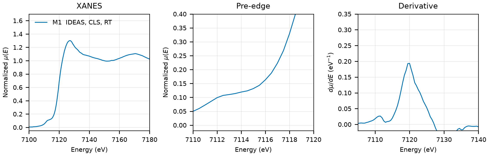

# Triphylite (LiFePO4)

## Overview

- **Mineral Name**: Triphylite (IMA approved)
- **Chemical Formula**: LiFePO4 (Lithium iron phosphate, olivine group)
- **Fe Oxidation State**: 2+
- **Coordination Geometry**: Distorted octahedral (O:6, site symmetry $m$)
- **Symmetry-Inequivalent Fe Sites**: 1 (Wyckoff `4c` in $Pnma$), the same in every structure in this folder
- **Structure**: Orthorhombic olivine-type crystal structure ($Pnma$, space group 62) consisting of edge-sharing $\text{FeO}_6$ octahedra forming zigzag chains parallel to the $c$-axis, cross-linked by tetrahedral $\text{PO}_4$ groups and $\text{Li}^+$ ions in 1D channels.

---

## Recommended Spectrum for Comparison with Calculations

- For conventional XANES calculations, use `XASDB/Lithium Iron (II) Phosphate_id498e7h.dat` (M1). It provides a transmission measurement with a simultaneous Fe foil reference channel for absolute energy calibration ($7112.0\text{ eV}$) and a $0.50\text{ eV}$ XANES grid.

---

## Crystal Structures

### Materials Project

| File | MP ID | Space Group | Lattice Parameters | $d$(Fe-O) |
| :--- | :--- | :--- | :--- | :--- |
| `MP/mp-19017.cif` | `mp-19017` | $Pnma$ (62) | $a = 10.2362\text{ \AA}, b = 5.9708\text{ \AA}, c = 4.6549\text{ \AA}$ | $2.0350$ to $2.2469\text{ \AA}$ (mean $2.1421\text{ \AA}$) |

Notes:

- The orthorhombic $Pnma$ symmetry of the CIF file matches the experimental triphylite space group at `symprec = 0.01`. The table uses the olivine axis order of the COD file ($a > b > c$); the spglib standard cell permutes the axes.
- The `material_id` field in `MP/mp-19017.json` reads `mp-aaaabcdl` (scrambled), so the file content itself does not confirm the `mp-19017` ID.
- `MP/mp-19017.json` lists 42 ICSD codes: `38209`, `56291`, `72545`, `92198`, `97764`, `99860`, `153699`, `154117`, `155580`, `155635`, `159107`, `160776`, `161479`, `162282`, `165000`, `166815`, `181272`, `181341`, `181342`, `183874`, `184652`, `184862`, `184863`, `185308`, `189057`, `190771`, `190772`, `193797`, `193799`, `193800`, `194331`, `200155`, `260569`, `260570`, `260571`, `260572`, `290334`, `290335`, `290336`, `290339`, `290718`, `290719`. One of them (`72545`) corresponds to the COD entry below.

### Crystallography Open Database (COD) and ICSD Cross-References

| File | ICSD ID | Space Group | Lattice Parameters | $d$(Fe-O) | Reference |
| :--- | :--- | :--- | :--- | :--- | :--- |
| `COD/cod_2100916.cif` | `72545` | $Pnma$ (62) | $a = 10.3320\text{ \AA}, b = 6.0100\text{ \AA}, c = 4.6920\text{ \AA}$ | $2.0639$ to $2.2507\text{ \AA}$ (mean $2.1567\text{ \AA}$) | Streltsov et al. (1993), *Acta Cryst. B* 49, 147 |

Notes:

- Ambient-condition end-member structure ($T \approx 298\text{ K}$, $P = 1\text{ atm}$); the CIF has no temperature tag, room temperature comes from the paper. The COD file is the Streltsov (1993) multipole refinement, not Rousse (2003) as stated before.
- `72545` matches the Streltsov (1993) cell and Fe, P coordinates ($V = 291.35\text{ \AA}^3$, $x_\text{Fe} = 0.2822$, $z_\text{Fe} = 0.9747$, $x_\text{P} = 0.0968$) in the AFLOW mirror of the ICSD entry, and the paper is in the MP provenance references.

---

## Experimental XAS Spectra

| ID | File | Source and date | $T$ | XANES step |
| :--- | :--- | :--- | :--- | :--- |
| M1 | `XASDB/Lithium Iron (II) Phosphate_id498e7h.dat` | IDEAS, CLS, 2023 (Blanchard et al.) | RT | $0.50\text{ eV}$ |

Notes:

- Recalculate the absorption spectrum from the raw detector columns as $\mu(E) = \ln(I_0 / I_{trans})$ (columns 2 and 3), because the 5th column (`Mutrans`) is min-max scaled to $[0, 1]$.
- Fe foil reference channel at $7112.0\text{ eV}$, so the axis is already calibrated.
- Transmission, $\mu x \approx 1.2$.
- $E_0 = 7120.0\text{ eV}$ (derivative maximum, single peak); pre-edge plateau at $7112.5$ to $7113.5\text{ eV}$ on the rising edge. The Fe site has no inversion center, hence the visible pre-edge.
