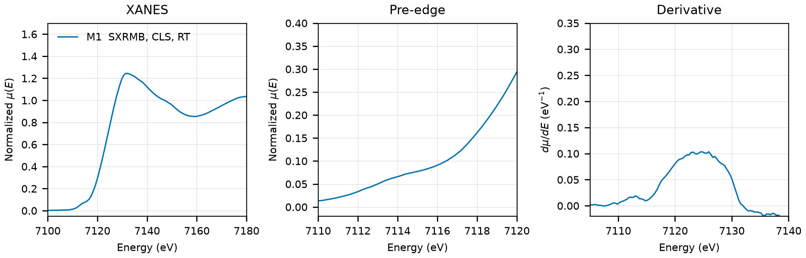

# Troilite (FeS)

## Overview

- **Mineral Name**: Troilite (IMA approved)
- **Chemical Formula**: FeS (Iron(II) sulfide)
- **Fe Oxidation State**: 2+
- **Coordination Geometry**: Distorted octahedral (S:6, site symmetry $1$)
- **Symmetry-Inequivalent Fe Sites**: 1 (Wyckoff `12i` in $P\bar{6}2c$), the same in every structure in this folder
- **Structure**: Hexagonal troilite crystal structure ($P\bar{6}2c$, space group 190), a stoichiometric supercell derivative of the NiAs structure with edge- and face-sharing distorted $\text{FeS}_6$ octahedra.

---

## Spectrum for Comparison with Calculations

**Do not use the spectrum in this folder as a troilite reference. It is not troilite.**

Aligned by a best rigid shift over $7105$ to $7165\text{ eV}$, the spectrum matches Fe3+ oxides and not a sulfide:

| Reference | Best shift | RMS |
| :--- | ---: | ---: |
| Hematite (`Hematite/NIST/Fe-Hematite.xdi`) | $-0.82\text{ eV}$ | $0.087$ |
| Goethite (`Goethite/NIST/Fe-Goethite.xdi`) | $-1.12\text{ eV}$ | $0.098$ |
| FeO (`Wustite/NIST/Fe-Wustite.xdi`) | $+3.50\text{ eV}$ | $0.066$ |
| $\text{FeS}_2$ (`Pyrite/XASLIB/FeS2_rt_01.xdi`) | $+2.86\text{ eV}$ | $0.145$ |

The Fe3+ oxides need almost no shift, so the energy axis is sound and the sample itself is oxidized. The weak pre-edge near $7114\text{ eV}$ is the Fe3+ position, against $\approx 7112\text{ eV}$ for Fe2+. The file carries both a total electron yield and a fluorescence channel, and both give the same oxide-like spectrum, so the oxidation is not limited to the grain surface.

---

## Crystal Structures

### Materials Project

| File | MP ID | Space Group | Lattice Parameters | $d$(Fe-S) |
| :--- | :--- | :--- | :--- | :--- |
| `MP/mp-2779.cif` | `mp-2779` | $P1$ (1) | $a = 5.8946\text{ \AA}, b = 5.8969\text{ \AA}, c = 11.4205\text{ \AA}, \alpha = 89.98^\circ, \beta = 89.97^\circ, \gamma = 60.02^\circ$ | $2.4622\text{ \AA}$ |

Notes:

- The table gives the conventional cell at `symprec = 0.01`, as in the rest of the corpus. The DFT-relaxed cell reaches the experimental $P\bar{6}2c$ (190) only at `symprec = 0.05` or looser, where it becomes $a = 5.8958\text{ \AA}$, $c = 11.4205\text{ \AA}$.
- Against King & Prewitt (1982), the cell contracts by $-1.1\%$ in $a$ and $-2.8\%$ in $c$.
- $d$(Fe-S) is the mean over all six S neighbours. The shell is strongly split, from $2.28$ to $2.81\text{ \AA}$ for MP and from $2.36$ to $2.72\text{ \AA}$ for COD.
- `MP/mp-2779.json` puts the structure $0.30\text{ eV/atom}$ above the hull (`is_stable: false`), and its `material_id` field reads `mp-aaaaaecx` (scrambled), so the file content itself does not confirm the `mp-2779` ID.
- `MP/mp-2779.json` lists 22 ICSD codes: `31963`, `35005`, `35006`, `35007`, `43694`, `44752`, `51001`, `51002`, `51003`, `53527`, `68845`, `68846`, `156618`, `156619`, `156620`, `291009`, `291010`, `291011`, `291012`, `291013`, `633296`, `657060`. Two of them (`156618`, `35005`) correspond to the COD entries below.

### Crystallography Open Database (COD) and ICSD Cross-References

| File | ICSD ID | Space Group | Lattice Parameters | $d$(Fe-S) | Reference |
| :--- | :--- | :--- | :--- | :--- | :--- |
| `COD/cod_9004034.cif` | `156618` | $P\bar{6}2c$ (190) | $a = 5.9650\text{ \AA}, c = 11.7570\text{ \AA}$ | $2.4918\text{ \AA}$ | Skála et al. (2006), *Am. Mineral.* 91, 917 ($T = 293\text{ K}$) |
| `COD/cod_9007650.cif` | `35005` | $P\bar{6}2c$ (190) | $a = 5.9630\text{ \AA}, c = 11.7540\text{ \AA}$ | $2.4916\text{ \AA}$ | King & Prewitt (1982), *Acta Cryst. B* 38, 1877 ($T = 294\text{ K}$, $P = 0.0001\text{ GPa}$) |

Notes:

- Both entries are stoichiometric ambient-condition end-member structures, with Fe on Wyckoff `12i` and site symmetry $1$ at `symprec = 0.01`. Only `cod_9007650.cif` records $T$ and $P$ in the CIF tags; the Skála temperature comes from the paper. `cod_9007650.cif` is the ambient point of a high-pressure and high-temperature series.
- `156618` matches the Skála (2006) cell and coordinates ($a = 5.965$, $c = 11.757\text{ \AA}$, $z_\text{S2} = 0.0198$, $z_\text{Fe} = 0.12303$) and `35005` the King & Prewitt (1982) ambient cell and coordinates ($a = 5.963$, $c = 11.754\text{ \AA}$, $z_\text{S2} = 0.0208$) in the AFLOW mirror; both papers are in the MP provenance references. `51001` is a King & Prewitt high-pressure point ($c = 11.52\text{ \AA}$). The Bertaut (1954) entry (`44752`) was removed as the oldest refinement.
- Against Skála et al. (2006), the most recent refinement, the MP mean $d$(Fe-S) is $-0.030\text{ \AA}$ ($-1.2\%$).

---

## Experimental XAS Spectra

| ID | File | Source and date | $T$ | XANES step |
| :--- | :--- | :--- | :--- | :--- |
| M1 | `XASDB/Iron (II) Sulfide_idozq8kn.dat` | SXRMB, CLS, 2024 (Mikhchian) | RT | $0.35\text{ eV}$ |

Notes:

- The header states TEY mode, but the file holds five columns: Energy, I0, TEY, Ifluor, Mufluor; the `Column.5` to `Column.7` keys in the header do not match. `spectra_comparison.py` reads Ifluor and I0. `Mufluor` is not a clean function of Ifluor/I0; do not use it.
- No reference foil channel, and no same-beamline foil in `Iron/`, so the absolute energy axis is unverified.
- The derivative is a plateau about $6\text{ eV}$ wide, from $7121$ to $7127\text{ eV}$, with no single maximum.
