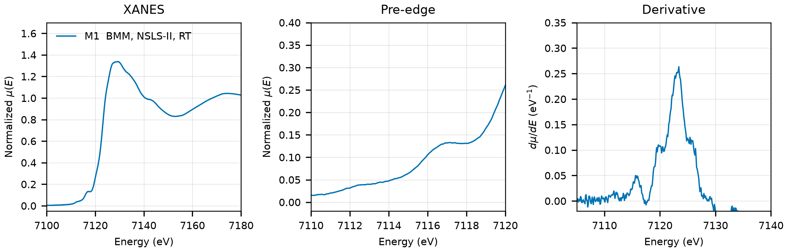

# Ferberite / Wolframite (FeWO4)

## Overview

- **Mineral Name**: Ferberite (Wolframite series Fe-endmember, IMA approved)
- **Chemical Formula**: FeWO4 (Iron(II) tungstate)
- **Fe Oxidation State**: 2+
- **Coordination Geometry**: Distorted octahedral (O:6, site symmetry $2$)
- **Symmetry-Inequivalent Fe Sites**: 1 (Wyckoff `2f` in $P2/c$), the same in every structure in this folder
- **Structure**: Monoclinic wolframite-type crystal structure ($P2/c$, space group 13) consisting of zigzag chains of edge-sharing $\text{FeO}_6$ octahedra running parallel to the $c$-axis, linked by $\text{WO}_6$ octahedra.

---

## Recommended Spectrum for Comparison with Calculations

- For conventional XANES calculations, use `NIST/Fe-K-Wolframite.xdi` (M1). It provides a high-resolution transmission measurement with a simultaneous Fe foil reference channel for absolute energy calibration ($7112.0\text{ eV}$) and a $0.10\text{ eV}$ XANES grid.

---

## Crystal Structures

### Materials Project

| File | MP ID | Space Group | Lattice Parameters | $d$(Fe-O) |
| :--- | :--- | :--- | :--- | :--- |
| `MP/mp-19421.cif` | `mp-19421` | $P2/c$ (13) | $a = 4.6988\text{ \AA}, b = 5.6553\text{ \AA}, c = 4.9880\text{ \AA}, \beta = 90.13^\circ$ | $2.0533$ to $2.1101\text{ \AA}$ (mean $2.0898\text{ \AA}$) |

Notes:

- The monoclinic $P2/c$ symmetry of the CIF file matches the experimental ferberite space group at `symprec = 0.01`. spglib places the MP Fe on Wyckoff `2e`, the COD files on `2f`; the two positions differ only by the origin choice.
- The `material_id` field in `MP/mp-19421.json` reads `mp-aaaabcsz` (scrambled), so the file content itself does not confirm the `mp-19421` ID.
- `MP/mp-19421.json` lists 5 ICSD codes: `15192`, `15193`, `26811`, `26843`, `64733`. Two of them (`15192`, `26843`) correspond to the COD entries below; `15193` and `26811` are the second Escobar sample (common wolframite), `64733` a duplicate of the Ülkü cell.

### Crystallography Open Database (COD) and ICSD Cross-References

| File | ICSD ID | Space Group | Lattice Parameters | $d$(Fe-O) | Reference |
| :--- | :--- | :--- | :--- | :--- | :--- |
| `COD/cod_9000223.cif` | `15192` | $P2/c$ (13) | $a = 4.7530\text{ \AA}, b = 5.7200\text{ \AA}, c = 4.9680\text{ \AA}, \beta = 90.08^\circ$ | $2.0191$ to $2.1615\text{ \AA}$ (mean $2.0873\text{ \AA}$) | Escobar et al. (1971), *Am. Mineral.* 56, 489 (sample "light wolframite") |
| `COD/cod_9008124.cif` | `26843` | $P2/c$ (13) | $a = 4.7300\text{ \AA}, b = 5.7030\text{ \AA}, c = 4.9520\text{ \AA}, \beta = 90.00^\circ$ | $2.0540$ to $2.1833\text{ \AA}$ (mean $2.1277\text{ \AA}$) | Ülkü (1967), *Z. Kristallogr.* 124, 192 (neutron diffraction) |

Notes:

- Both entries are ambient-condition end-member structures ($T \approx 298\text{ K}$, $P = 1\text{ atm}$); neither CIF has a temperature tag, room temperature comes from the papers.
- `15192` matches the Escobar (1971) cell and W, Fe, O coordinates ($V = 135.07\text{ \AA}^3$, $y_\text{W} = 0.1808$, $y_\text{Fe} = 0.3215$) and `26843` the Ülkü (1967) cell and coordinates ($V = 133.58\text{ \AA}^3$, $y_\text{Fe} = 0.6744$) in the AFLOW mirror of the ICSD entries; both papers are in the MP provenance references.

---

## Experimental XAS Spectra

| ID | File (XASDB duplicate) | Source and date | $T$ | XANES step |
| :--- | :--- | :--- | :--- | :--- |
| M1 | `NIST/Fe-K-Wolframite.xdi` (`XASDB/Wolframite_idlxnsgy.dat`) | BMM, NSLS-II, 2020 (Ravel) | RT | $0.10\text{ eV}$ |

Notes:

- `XASDB/Wolframite_idlxnsgy.dat`: XASDB copy of `NIST/Fe-K-Wolframite.xdi` (same energy, $I_0$, $I_t$, $I_r$) plus a min-max scaled `Mutrans` column.
- The XDI header names the sample `(Fe,Mn)WO4`, a natural wolframite (locality note "Cumberland, Black"), not end-member ferberite, so the Fe site carries an unknown Mn substitution on the neighbouring sites.
- Fe foil reference channel, derivative maximum $7111.2\text{ eV}$. Shift $+0.8\text{ eV}$ to put the foil at $7112.0\text{ eV}$.
- Transmission, $\mu x \approx 2.5$, of which $0.2$ comes from the sample.
- Derivative maximum $7123.5\text{ eV}$ (shifted axis, with shoulders at $7122.3$ and $7122.8\text{ eV}$). The pre-edge is a weak shoulder near $7113$ to $7114\text{ eV}$ with no resolved maximum, followed by a second shoulder at $7117\text{ eV}$ on the rising edge.
