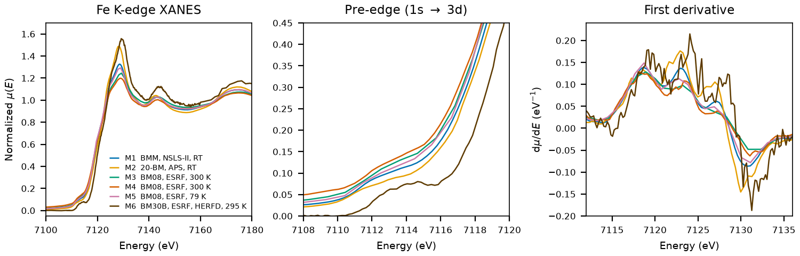

# Wüstite (Wustite)

## Overview

- **Mineral Name**: Wüstite (IMA approved)
- **Chemical Formula**: FeO (Iron(II) oxide)
- **Fe Oxidation State**: Fe2+
- **Coordination Geometry**: Octahedral (O:6, site symmetry $m\bar{3}m$)
- **Symmetry-Inequivalent Fe Sites**: 1 (Wyckoff `4a`), the same in every structure in this folder
- Real wüstite is non-stoichiometric Fe$_{1-x}$O with cation vacancies and some Fe3+. Every structure in this folder is the idealized stoichiometric end-member.

---

## Recommended Spectrum for Comparison with Calculations

- For conventional XANES calculations, use `NIST/Fe-Wustite.xdi` (M1). It is the only measurement that combines raw $\mu$, a simultaneous Fe foil reference channel for absolute energy calibration, and a dense XANES grid.
- For HERFD calculations, use `FAME/Iron_(II)_Oxide_HERFD_SPECTRUM_SOC_20181115_004H.dat` (M6).

---

## Crystal Structures

### Materials Project

  
| File | MP ID | Space Group | Lattice Parameters | $d$(Fe-O) |
| :--- | :--- | :--- | :--- | :--- |
| `MP/mp-18905.cif` | `mp-18905` | $Fm\bar{3}m$ (225) | $a = 4.2624\text{ \AA}$ | $2.1312\text{ \AA}$ |

Notes:

- The CIF file is the symmetrized conventional cell; spglib gives $Fm\bar{3}m$ at `symprec = 0.01`. `MP/mp-18905.json` puts the structure $0.41\text{ eV/atom}$ above the hull (`is_stable: false`).
- The lattice parameter is 1.5% smaller than the 298 K experimental value ($4.2624$ against $4.3260\text{ \AA}$).
- `MP/mp-18905.json` lists 14 ICSD codes: `27856`, `31081`, `53519`, `60683`, `76639`, `82233`, `82236`, `180972`, `180973`, `180974`, `633029`, `633031`, `633036`, `633038`. One of them (`82233`) corresponds to the COD entry below.

### Crystallography Open Database (COD) and ICSD Cross-References

| File | ICSD ID | Space Group | Lattice Parameters | $d$(Fe-O) | Reference |
| :--- | :--- | :--- | :--- | :--- | :--- |
| `COD/cod_9009766.cif` | `82233` | $Fm\bar{3}m$ (225) | $a = 4.3260\text{ \AA}$ | $2.1630\text{ \AA}$ | Fjellvåg et al. (1996), *J. Solid State Chem.* 124, 52 ($T = 298\text{ K}$) |

Notes:

- Ambient-condition stoichiometric end-member ($T = 298\text{ K}$ in the CIF tag).
- `82233` matches the Fjellvåg (1996) cell ($a = 4.326\text{ \AA}$) in the AFLOW mirror, and the paper is in the MP provenance references; `53519` is a different cell ($a = 4.354\text{ \AA}$). The Jette & Foote (1933) and Wyckoff & Crittenden (1926) entries were removed (`31081` does match the 1926 cell, $a = 4.303\text{ \AA}$, but it is a 1926 powder value).

---

## Experimental XAS Spectra

Eight files, **six unique measurements**: M1 and M2 each appear twice under different database names. Take the XDI or FAME file, never the XASDB copy.

| ID | File (XASDB duplicate) | Source and date | $T$ | XANES step |
| :--- | :--- | :--- | :--- | :--- |
| M1 | `NIST/Fe-Wustite.xdi` (`XASDB/Wustite_id6cn8xf.dat`) | BMM, NSLS-II, 2023 (Ravel) | RT | $0.30\text{ eV}$ |
| M2 | `XASLIB/FeO_rt_01.xdi` (`XASDB/Iron (II) Oxide_idwdf05o.dat`) | 20-BM, APS, 2001 (Newville) | RT | $0.42\text{ eV}$ |
| M3 | `XASDB/Iron (II) Oxide_idg74ufm.dat` | BM08-GILDA, ESRF, 2018 (Puri) | 300 K | $1.30\text{ eV}$ |
| M4 | `XASDB/Iron (II) Oxide_idq2cv7k.dat` | BM08-GILDA, ESRF, 2008 (Puri) | 300 K | $0.34\text{ eV}$ |
| M5 | `XASDB/Iron (II) Oxide_idxvotm2.dat` | BM08-GILDA, ESRF, 2003 (Puri) | 79 K | $1.05\text{ eV}$ |
| M6 | `FAME/Iron_(II)_Oxide_HERFD_SPECTRUM_SOC_20181115_004H.dat` | BM30B, ESRF, 2018 (Ould-Chikh et al.) | 295 K | $0.20\text{ eV}$ |

All scans are Fe K-edge, transmission except M6 (fluorescence HERFD).

Notes:

- The XASDB copies of M1 and M2 hold the same energy and raw intensity columns plus a min-max scaled `Mutrans` in $[0, 1]$; take the XDI files.
- M1: Fe foil reference channel, derivative maximum $7111.6\text{ eV}$. Shift $+0.4\text{ eV}$ to put the foil at $7112.0\text{ eV}$. M4: foil at $7112.0\text{ eV}$, so the axis is already calibrated. M2: no foil channel; the 20-BM foil of the previous day (`Iron/XASLIB/Fe_metal_rt_02.xdi`) sits at $7111.5\text{ eV}$, so the axis is about $0.5\text{ eV}$ low. M3, M5, M6: no foil channel and no same-day foil in `Iron/`, axis unverified. For M6 a broadening plus shift fit against M1 suggests a $\approx 1\text{ eV}$ offset.
- Transmission except M6 (fluorescence HERFD). M1: $\mu x \approx 5$ above the edge, too thick for reliable amplitudes, which suppresses the white line by about 10% compared to M2; use energies from M1 and amplitudes from M2 and M4. M2: $\mu x \approx 1.1$. M3 to M5: $\mu x \approx 0.7$ to $0.8$.
- Two derivative maxima of equal height at $7119$ and $7123\text{ eV}$ (M1, shifted axis), so no single $E_0$. The pre-edge is a pair of weak shoulders near $7112$ and $7114\text{ eV}$ with no resolved maximum.
- A shift-and-broadening fit places the room-temperature M2 to M4 lineshapes within $0.5\text{ eV}$ of M1. An NNLS fit against Fe$_3$O$_4$, Fe$_2$O$_3$, and Fe foil references detects no magnetite or hematite contamination.
- M5 at 79 K is below the 198 K Néel temperature, so it represents the rhombohedrally distorted antiferromagnetic phase rather than the cubic phase.
- M6 uses HERFD, which removes part of the Fe 1s lifetime broadening, so the lineshape differs from a conventional transmission spectrum (range 7079 to 7352 eV, no EXAFS).
